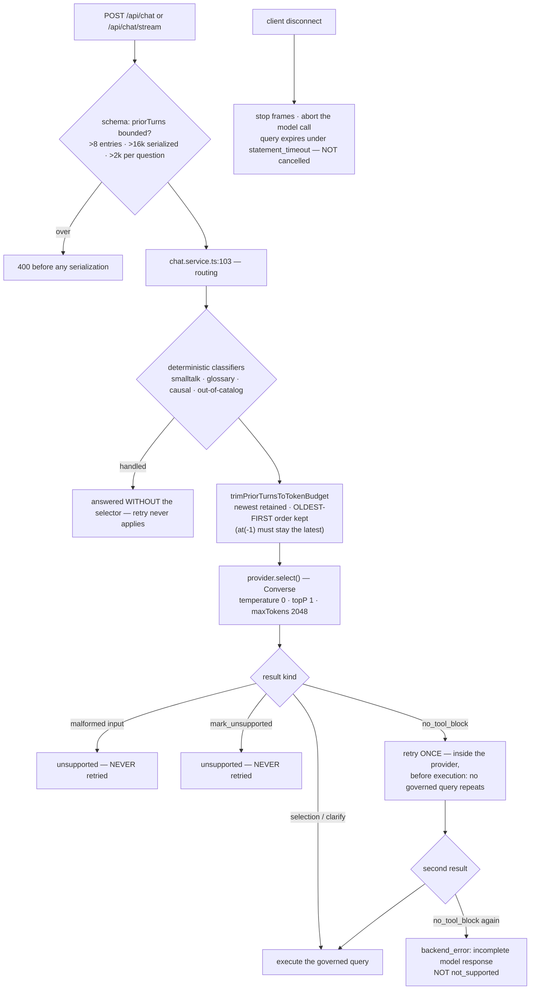

# Task plan — assistant-bounded-generation: cap the generation, scope the retry, bound the request

Story: `poc-responsiveness` · Task 1 of 3 · **user_facing: false** · **ships the reported fix on its own**

## Objective
A follow-up question took **39s**, **57s**, and **214s** in reproduction. The cause is one missing
field: `backend/src/llm/bedrock.provider.ts:394` sends `inferenceConfig: { temperature: 0, topP: 1 }`
and **no `maxTokens`**. This task adds the cap, makes its guard safe, bounds the request, and stops
an abandoned stream doing work.

## Acceptance criteria (plan_contracts)
- **t-abg-c1** — `maxTokens: 2048` on the selector Converse request, asserted on the **request**.
- **t-abg-c2** — a tool-less response retries **once**; malformed input and `mark_unsupported` never do.
- **t-abg-c3** — `priorTurns` bounded **before serialization**; oldest-first order preserved.
- **t-abg-c4** — disconnect aborts the model call; an in-flight query is **bounded, not cancelled**.
- **t-abg-c5** — six hermetic leaves, D-0006 formatting, CI registration.

## The measurement this task is built on
Run directly against Bedrock with the real system prompt, the real three-tool schema, the same
question and the same single prior turn:

| request | latency | output tokens | stopReason | tool block |
| --- | --- | --- | --- | --- |
| no `maxTokens` | 214,222 ms | 24,313 | — | — |
| `maxTokens: 2048` | 1,429 ms | 168 | `tool_use` | yes |
| `maxTokens: 512` | 1,703 ms | 203 | `tool_use` | yes |

The capped runs stop at **`tool_use`**, not `max_tokens` — the cap ends the runaway **without
truncating**. With no prior turn the uncapped call already returned in 0.8–1.3s, which is why a
timing test proves nothing and the assertion must inspect the request.

## What already exists (grounding, file:line)
- `backend/src/llm/bedrock.provider.ts:394` — the only `inferenceConfig`, with no `maxTokens`.
- `backend/src/llm/bedrock.provider.ts:227` — `mapBedrockToolUseToSelectionResult` returns
  `{kind:"unsupported"}` for **absent tool use**, **malformed input** and a valid
  **`mark_unsupported`** alike. Three outcomes, one result. A retry cannot be scoped until they part.
- `backend/src/llm/llm.interface.ts:36` — `LlmProvider.select(input)`, no abort parameter.
- `backend/src/llm/mock.provider.ts` — must follow the port.
- `backend/src/chat/chat.service.ts:103` — `routing` is emitted, and routing happens, **before** the
  deterministic classifiers, so smalltalk/glossary/causal/out-of-catalog never reach the selector.
- `backend/src/chat/chat.service.ts:675` — `trimPriorTurnsToTokenBudget`, called at `:153`; it
  `shift()`s the oldest until the serialized turns fit, re-serializing on **every iteration**.
- `backend/src/chat/chat.service.ts:153` — `priorTurns.at(-1)` is read as the **latest** turn.
- `backend/src/chat/chat.schemas.ts:21` — `priorTurns` is an **unbounded** array of unbounded questions.
- `backend/src/chat/chat.controller.ts` — writes SSE frames and `response.end()`s in `finally`; it
  observes **no** client disconnect.
- `backend/src/warehouse/postgres.adapter.ts:90` — `statement_timeout`/`query_timeout`; error
  `57014` is the timeout code. A timeout, not a cancellation.
- `.prettierignore:34` — `backend/src/llm/bedrock.provider.ts` is ignored (**D-0006**).

## Workflow

## Manual Verification
1. Start the servers with `BEDROCK_MODEL_ID` set. Ask a question, then ask a **follow-up in the same
   thread** — the case that took 39s and 57s. It should return in **under 5 seconds**.
2. Query `audit_events` (NOT the backend log — `latency_ms` and `output_tokens` are audit-row
   fields) and confirm the follow-up's values are in the hundreds, not the thousands.
3. `grep -n "maxTokens" backend/src/llm/bedrock.provider.ts` — the cap is on the request, not
   configured away.
4. Post `/api/chat` with 9 prior turns, then with one 3,000-character prior question — both return
   **400** and the backend logs no serialization work.
5. Start a streamed question and close the tab mid-flight; confirm the backend stops writing frames
   and records **no** `backend_error`.
6. `npm run build:contract && npm run build:backend && npm run typecheck && npm run lint &&
   npm run format:check && npm run test:hermetic` — the six required leaves pass, each confirmed by
   its junit testcase **name** and **executed count**, never the exit code (D-0024, D-0031).

## What the grill changed (all nine verified against the repo)
- **The plan says five tasks; the decomposition has three.** The human chose three *after* the plan
  was approved, and the plan body is digest-locked — so the decomposition is the later authority and
  this task owns the server-side cancellation the plan had put in its task 2.
- **The port could not express the promise.** `LlmSelectionOutcome` (`llm.interface.ts:27`) is
  `selection | clarify | unsupported`, and `chat.service.ts:177` treats anything else as a selection,
  so "answer `backend_error`" was unrepresentable. Two new outcomes, handled explicitly.
- **Absent ≠ malformed.** `bedrock.provider.ts:231` tests `!toolUse?.name`, true for *both* — so the
  retry could fire on malformed input, which the contract forbids.
- **An identical retry is a no-op.** Temperature is 0; attempt two now raises the cap, and is skipped
  entirely if cancellation has arrived.
- **`request.on("close")` is the wrong signal** — Node emits `IncomingMessage`'s `close` on *normal*
  completion, so that listener would abort healthy SSE requests. A premature response/socket close is
  required, with a test proving normal completion does **not** abort.
- **The abort must reach `send()`** — `bedrock.provider.ts:382` calls `send(command)` with no
  options, so a fake that merely receives a signal proves nothing.
- **A query must not *start* after an abort** — `SelectionExecutor.run` awaits `explain()` before
  `execute()`, so the check belongs immediately before `execute()`.
- **D-0006 covers four files, not one** — `bedrock.provider.ts`, `llm.constants.ts`,
  `mock.provider.ts` and `chat.constants.ts` are all ignored *and* baseline-pinned.
- **Two of my manual checks were impossible** — `latency_ms` and `output_tokens` live in
  `audit_events`, not the backend log. Corrected below.

## Out of scope
The streaming client, the freshness pill and the dock (tasks 2 and 3). Changing the model or region
(**0027** stands — the model is exonerated by measurement). True Postgres query cancellation
(`pg_cancel_backend`) — human-decided out of scope; queries expire under `statement_timeout`.

<!-- forge:contract -->
## Contract (recorded)

Rendered by the harness from the recorded decomposition; edit the decomposition, not this block. It is excluded from the plan's approval and grill digests, so a re-render never stales either.

**Objective.** Fix the reported latency at its measured cause: the selector Converse call sends no maxTokens, so a follow-up question can generate 24,313 output tokens over 214 seconds for a job that needs about 110. Add the cap, give the provider a no_tool_block discriminant so a guarded single retry cannot mask a genuine refusal, bound the priorTurns request for server resource safety, and wire bounded server-side cancellation. Backend only - the streaming client, the pill and the dock are task 3.

**Acceptance criteria**

- The selector Converse request carries maxTokens 2048, asserted on the REQUEST OBJECT the provider builds - never by timing, because the uncapped call is already fast when there is no prior turn, so a timing test passes without the fix. bedrock.provider.ts:394 sends only { temperature: 0, topP: 1 } today. Measured with the real prompt, the real three-tool schema, the same question and one prior turn: uncapped 214,222ms / 24,313 output tokens; maxTokens 2048 1,429ms / 168 tokens, stopping at stopReason tool_use rather than max_tokens - the cap ends the runaway WITHOUT truncating. 2048 is ~18x a real ~110-token selection and ~8% of the runaway.
- A selector response with NO TOOL BLOCK is retried at most once, and the retry cannot mask a genuine refusal or be a no-op. THREE changes make this expressible. (1) The port gains outcomes it does not have: LlmSelectionOutcome (llm.interface.ts:27) is today selection | clarify | unsupported, with no backend-error arm, and chat.service.ts:177 treats anything that is not clarify or unsupported AS A SELECTION - so 'answer backend_error' is unrepresentable and throwing would produce a buffered HTTP envelope rather than the typed AskResponse this contract promises. Add a distinct no_tool_block outcome AND a backend-error outcome, both handled explicitly by chat.service. (2) The mapper must stop conflating ABSENT with MALFORMED: bedrock.provider.ts:231 tests !toolUse?.name, which is true both when there is no tool block at all and when a block is present with no name, so malformed input could be retried - which this criterion forbids. Distinguish undefined from a present-but-malformed block. (3) The second attempt must DIFFER from the first: repeating an identical capped, temperature-zero request would deterministically reproduce the same tool-less result rather than recover it, so attempt two RAISES the cap; and attempt two is NOT made if cancellation has arrived. Malformed input and a valid mark_unsupported are NEVER retried. At most two selector calls per question; a second tool-less response yields the backend-error outcome naming an incomplete model response, NEVER not_supported. The retry runs INSIDE the provider, before chat.service reaches execution, so 'no repeated governed query' is structural. Routing precedes selection (chat.service.ts:103), so smalltalk, glossary, causal and out-of-catalog paths never reach it.
- The request is bounded as SERVER RESOURCE SAFETY - explicitly NOT the latency fix, which is C1; the reproduction used ONE prior turn well inside the existing budget, so no amount of trimming would have helped. chat.schemas.ts:21 accepts an unbounded priorTurns array of unbounded questions today. It now rejects more than 8 entries, a JSON.stringify(priorTurns) payload over 16,000 characters, or any single prior question over 2,000 characters - evaluated AT INGRESS, before the trim and before Bedrock-prompt construction, with nested selection fields inside that measured representation. The limits are exported from @3f/contract, the only package the frontend can import, so task 3's client can trim to the SAME contract; without that the ninth ask in a conversation becomes a 400. trimPriorTurnsToTokenBudget (chat.service.ts:675) keeps its behaviour exactly: newest turns retained, OLDEST-FIRST transport order preserved, because chat.service.ts:153 reads priorTurns.at(-1) as the latest turn.
- Server-side cancellation is wired and is BOUNDED, not total - human-decided 2026-09-14 and written at the seam so it is never later filed as a defect. The signal must be a PREMATURE RESPONSE/SOCKET CLOSE, not request.on('close'): Node emits IncomingMessage's close on NORMAL completion too, so that listener would abort healthy SSE requests and miss real abandonment. On abandonment the controller stops writing frames and aborts the model call through an AbortSignal that reaches the AWS transport - bedrock.provider.ts:382 calls send(command) with no options today, so the signal must be passed to send() and not merely accepted by the provider, or the proof false-greens on a fake. The abort is ALSO checked at the executor seam immediately before warehouse.execute(): SelectionExecutor.run awaits warehouse.explain() first, so an abort arriving during that await must prevent the query STARTING. A query already in flight is NOT cancelled - it expires under the existing Postgres statement_timeout (postgres.adapter.ts:90, code 57014) - and a comment says so. An expected abort is handled silently and never recorded as backend_error.
- The behaviour is proven by hermetic leaves, each judged by its junit testcase NAME and EXECUTED count and never an exit code (D-0024, D-0031): the built Converse request contains maxTokens; a tool-less response retries once with a RAISED cap; a present-but-malformed tool block does NOT retry; a valid mark_unsupported does NOT retry; a no_tool_block followed by mark_unsupported or clarify returns THAT outcome rather than masking it - the sequence most likely to hide a genuine refusal; a second tool-less response yields backend_error and not not_supported; the schema rejects an oversize array, an oversize serialized payload and an oversize single question; retention keeps newest turns in oldest-first order; a NORMAL completion does NOT abort while a premature close DOES; the abort reaches send() and prevents a not-yet-started query. Under D-0006 FOUR scoped files are prettier-ignored and baseline-pinned - bedrock.provider.ts, llm.constants.ts, mock.provider.ts and chat.constants.ts - so every one this task edits is formatted, removed from .prettierignore, and has its entry removed from the quality-gate baseline map in the SAME change, or quality-gate fails. New backend test files are registered in backend/package.json test:hermetic AND tools/quality-gate.test.mjs, or CI runs none of them.

**Write scope** (what `stage done` measures the diff against)

- .prettierignore
- backend/package.json
- backend/src/chat/chat.constants.ts
- backend/src/chat/chat.controller.test.ts
- backend/src/chat/chat.controller.ts
- backend/src/chat/chat.schemas.test.ts
- backend/src/chat/chat.schemas.ts
- backend/src/chat/chat.service.test.ts
- backend/src/chat/chat.service.ts
- backend/src/chat/selectionExecutor.ts
- backend/src/llm/bedrock.provider.test.ts
- backend/src/llm/bedrock.provider.ts
- backend/src/llm/llm.constants.ts
- backend/src/llm/llm.interface.ts
- backend/src/llm/mock.provider.ts
- contract/src/api.ts
- tools/quality-gate.test.mjs

**Required tests** (run by `stage done`)

- `the selector converse request carries an explicit max tokens cap` -- `TS_NODE_PROJECT=backend/tsconfig.json TS_NODE_TRANSPILE_ONLY=1 node tools/junit-run.mjs --file {path} --name {id} --report {report} --require ts-node/register` (backend/src/llm/bedrock.provider.test.ts)
- `a response with no tool block retries once while a malformed input and a mark unsupported never retry` -- `TS_NODE_PROJECT=backend/tsconfig.json TS_NODE_TRANSPILE_ONLY=1 node tools/junit-run.mjs --file {path} --name {id} --report {report} --require ts-node/register` (backend/src/llm/bedrock.provider.test.ts)
- `a second response with no tool block answers backend error rather than not supported` -- `TS_NODE_PROJECT=backend/tsconfig.json TS_NODE_TRANSPILE_ONLY=1 node tools/junit-run.mjs --file {path} --name {id} --report {report} --require ts-node/register` (backend/src/llm/bedrock.provider.test.ts)
- `the request schema rejects an oversize prior turns array payload or question before serialization` -- `TS_NODE_PROJECT=backend/tsconfig.json TS_NODE_TRANSPILE_ONLY=1 node tools/junit-run.mjs --file {path} --name {id} --report {report} --require ts-node/register` (backend/src/chat/chat.schemas.test.ts)
- `trimming retains the newest turns in oldest first order` -- `TS_NODE_PROJECT=backend/tsconfig.json TS_NODE_TRANSPILE_ONLY=1 node tools/junit-run.mjs --file {path} --name {id} --report {report} --require ts-node/register` (backend/src/chat/chat.service.test.ts)
- `a client disconnect stops frame writes aborts the model call and records no backend error` -- `TS_NODE_PROJECT=backend/tsconfig.json TS_NODE_TRANSPILE_ONLY=1 node tools/junit-run.mjs --file {path} --name {id} --report {report} --require ts-node/register` (backend/src/chat/chat.controller.test.ts)
- `a no tool block followed by a mark unsupported returns that refusal rather than masking it` -- `TS_NODE_PROJECT=backend/tsconfig.json TS_NODE_TRANSPILE_ONLY=1 node tools/junit-run.mjs --file {path} --name {id} --report {report} --require ts-node/register` (backend/src/llm/bedrock.provider.test.ts)
- `a normal completion does not abort while a premature close aborts and reaches the send call` -- `TS_NODE_PROJECT=backend/tsconfig.json TS_NODE_TRANSPILE_ONLY=1 node tools/junit-run.mjs --file {path} --name {id} --report {report} --require ts-node/register` (backend/src/chat/chat.controller.test.ts)

**Verify commands**

- `npm run build:contract`
- `npm run build:backend`
- `npm run typecheck`
- `npm run lint`
- `npm run format:check`
- `npm run test:hermetic`

**Review budget.** 17 files / 1700 lines -- One request field is the fix, but making its guard safe means adding two outcomes to the LlmProvider port and handling them in chat.service, separating absent from malformed tool blocks, raising the cap on a second attempt, threading an AbortSignal to the AWS send() call and to the executor seam before a query starts, ingress limits shared through @3f/contract, and D-0006 formatting of up to four prettier-ignored baseline-pinned files. Eight hermetic leaves. No UI.
<!-- /forge:contract -->
