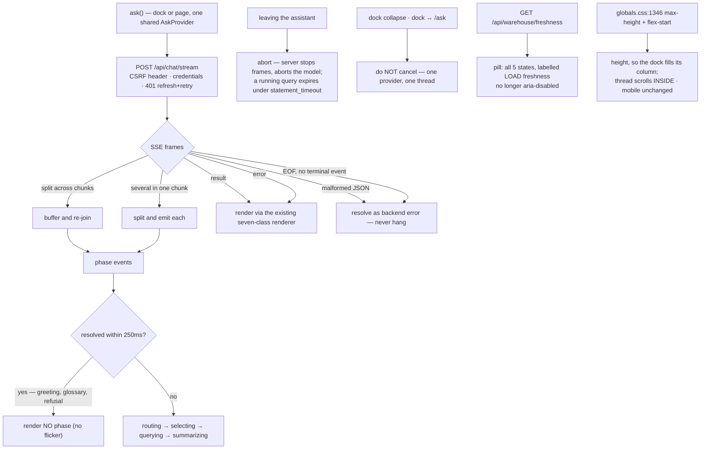

# Task plan — assistant-streaming-and-shell: show the work, tell the truth, fill the column

Story: `poc-responsiveness` · Task 3 of 3 · **user_facing: true** · frontend only

## Objective
Tasks 1 and 2 made the assistant fast and gave the shell something true to show. Neither is
visible yet: the Ask surfaces still call the buffered route and show one static pending state, and
the top bar still renders a hard-coded disabled chip. This task makes both real.

## Acceptance criteria (plan_contracts)
- **t-ass-c1** — both surfaces stream; SSE framing and terminal failures handled, never hanging.
- **t-ass-c2** — no phase at all for an answer resolving within **250 ms** (a *client* rule).
- **t-ass-c3** — full transport parity: CSRF, credentials, the **401 refresh**, HTTP errors.
- **t-ass-c4** — leaving cancels; dock collapse and dock ↔ Ask do **not**.
- **t-ass-c5** — the pill renders **all five** states, labelled **load** freshness.
- **t-ass-c6** — the dock fills its column; mobile unchanged.
- **t-ass-c7** — six vitest leaves, both design skills, a live check.

## What already exists (grounding, file:line)
- `contract/src/api.ts:552` — `ChatStreamEvent` is `phase | token | result | error`; the phases are
  `routing → selecting → querying → summarizing`.
- `backend/src/chat/chat.service.ts:103` — `routing` is emitted **before** the deterministic
  classifiers, so greetings, glossary answers and policy refusals **do** receive a phase today.
  That is why no-flicker is a client delay, not a producer change.
- `frontend/src/lib/api.ts:125` — `ask` posts to the **buffered** `/api/chat`; nothing references
  `/api/chat/stream`. `:22-40` is the transport the stream client must match: the CSRF bootstrap,
  the `x-csrf-token` header, `credentials: "include"`, and the **401 refresh-and-retry**.
- `frontend/src/features/assistant/use-ask.ts:12` — one `AskContextValue` shared by the dock and
  the page, with `ask` and `rerun`. A promise that never resolves hangs **both** surfaces.
- `frontend/src/components/shell/app-shell.tsx:174` — the `Freshness unavailable` chip, static text
  with `aria-disabled="true"`.
- `GET /api/warehouse/freshness` (task 2, merged) — five states: `available`, `no-active-batches`,
  `unsupported`, `unconfigured`, `lookup-failed`, each carrying `freshnessKind: "load"`.
- `frontend/app/globals.css:1346` — `max-height: calc(100vh - 98px)` with `align-self: flex-start`:
  a **ceiling**, not a height, which is the reported gap.
- Task 1 measured the follow-up at **1.0–5.4s** after the cap change — the live check must expect a
  few seconds with occasional excursions, **not** a hard sub-5s bound.

## Workflow

## Manual Verification
1. Ask a question on the docked panel: phases appear in order and the answer renders through the
   existing renderer.
2. Ask a **follow-up** — the case that took 39s before task 1. It returns in **a few seconds**
   (measured 1.0–5.4s) with phases visible. Report the number you observe; do not assert a bound.
3. Say `hello`: it answers immediately and **no phase flashes** — the server still emits `routing`,
   so this proves the client delay, not a server change.
4. In DevTools → Network, confirm the request is `POST /api/chat/stream` and carries
   `x-csrf-token` with credentials. Force a 401 and confirm it refreshes and retries rather than
   rendering a stream error.
5. Start a question, then **collapse the dock** and **navigate dock → /ask**: the question is still
   running and its answer still arrives. Then **leave the assistant** mid-flight and confirm the
   backend stops writing frames.
6. Read the top bar: a real load-freshness value, not `aria-disabled`. Stop the warehouse and
   confirm the pill shows the **specific** state rather than a blank.
7. **This is the geometry proof — jsdom cannot do it.** Open a report with the dock: the panel **fills the column**, the thread scrolls inside it, and
   the composer is reachable without scrolling the report. Narrow to mobile: stacking is unchanged.
8. `npm run build:contract && npm run build:frontend && npm run typecheck && npm run lint &&
   npm run format:check && npm run test:hermetic` — six leaves, each confirmed by its junit
   testcase **name** and **executed count**, never the exit code (D-0024, D-0031).

## What the grill changed
- **A live defect, fixed here.** `use-ask.ts:31` sends every successful turn; task 1's schema rejects
  more than 8 — so the **ninth question in a conversation 400s against merged code today**. The
  client now trims newest-first to the shared `@3f/contract` limits.
- **Streaming is not universal.** One `run()` sits behind both `ask()` and `rerun()`, so a wholesale
  switch would move the stored-selection re-run onto the stream; it must stay buffered.
- **An abort currently renders as an error** (generic catch), and terminal SSE error frames lack the
  fields the seven-class renderer needs. Both must be normalised, and delayed-phase timers cleared on
  every terminal path.
- **Byte-level chunking** — a multi-byte UTF-8 character split across two chunks must not corrupt a frame.
- **Dock geometry cannot be unit-proven**: jsdom does not compute flex layout, so a vitest leaf would
  assert CSS source text and be a false green. **The live check is the geometry proof.**
- **The pill has six states**, not five: the route's five plus a client-side "could not check".
- **Decided with the human:** the assistant area is exactly `/ask` and `/mis-reports`; the pill gets
  distinct copy per state with an explicit timezone; **512** is the governed cap and the live check
  **reports** latency rather than enforcing a bound.
- **Recorded against merged code, out of scope here:** **D-0042** (a partially loaded warehouse can
  show one source's load time as if it were both) and **D-0043** (`chat.service.ts:170` starts
  `distinctValues` before the abort check).

## Out of scope
`provenance.dataAsOf`, which stays null under **D-0041**. Changing the buffered `/api/chat` route,
which still serves the stored-selection re-run. True Postgres query cancellation. The Pulse-inherited
selector prompt examples and D-0040.

<!-- forge:contract -->
## Contract (recorded)

Rendered by the harness from the recorded decomposition; edit the decomposition, not this block. It is excluded from the plan's approval and grill digests, so a re-render never stales either.

**Objective.** Make a slow answer look like work rather than a hang, and stop the shell showing a dead control. Both Ask surfaces consume the already-built POST /api/chat/stream and render its ordered phases; the freshness pill renders the real load-freshness value; and the docked panel fills its column. Frontend only.

**Acceptance criteria**

- Both Ask surfaces consume POST /api/chat/stream and render its ordered phases - routing, selecting, querying, summarizing (contract/src/api.ts:552) - instead of one static pending state. The client parses SSE correctly in both directions the transport actually produces: a single frame SPLIT ACROSS CHUNKS and SEVERAL frames arriving in ONE chunk. It also handles the stream's failure modes rather than hanging: a MALFORMED JSON frame and an EOF carrying neither result nor error each resolve the request as a backend error, because AskProvider is shared by the dock and the page and an unresolved promise leaves BOTH surfaces pending forever. A phase never renders after the terminal frame, and any pending render-delay timer is CLEARED on every terminal path. Chunk boundaries are handled at the BYTE level, not the character level: a multi-byte UTF-8 character split across two chunks must not corrupt the frame.
- An answer that resolves within 250ms renders NO PHASE AT ALL. This is a CLIENT render delay, not a producer change: chat.service.ts:103 emits routing BEFORE the deterministic classifiers run, so a greeting, a glossary definition and a policy refusal DO receive a phase today and do not resolve before the first one. Suppressing it server-side would mean not emitting a phase the server has already decided to emit; delaying it client-side leaves the producer untouched and still removes the flicker.
- The streaming client preserves EVERYTHING the buffered client does, because pre-stream failures are ordinary HTTP responses and not SSE frames: the CSRF bootstrap and x-csrf-token header, credentials: include, the 401 refresh-and-retry path, and HTTP-error rendering (frontend/src/lib/api.ts:22-40 is the existing behaviour). A 401 on the stream must refresh and retry exactly as a buffered post does, not surface as a stream error. THE SWITCH TO STREAMING IS NOT UNIVERSAL. use-ask.ts:27 has ONE run(question, selection?) serving both ask() and rerun(), so streaming everything would move the stored-selection re-run onto the stream as well - it bypasses the model, needs no progress display, and must stay on buffered POST /api/chat. The branch is explicit and proven by a leaf. Ordinary HTTP errors from the stream request - not SSE error frames - render exactly as the buffered client renders them.
- Leaving the assistant cancels the in-flight request, and the cancellation is BOUNDED as task 1 built it: the client aborts, the server stops writing frames and aborts the model call, and a query already running expires under statement_timeout rather than being cancelled. Collapsing the dock does NOT cancel, and moving between the dock and the Ask page does NOT cancel - one AskProvider holds one thread, so a valid transition must not discard a question in flight. The assistant area is exactly /ask and /mis-reports - human-decided 2026-09-14: navigation WITHIN that set never cancels, and any other authenticated route aborts. The routes must be NAMED because AskProvider lives in the persistent authenticated shell, so an unmounting panel cannot own the boundary. An expected abort is never rendered as an error: today it falls into the generic catch and surfaces as one, so it must be recognised and swallowed silently. Terminal SSE error frames must also be NORMALISED into the fields the seven-class AskResponse renderer requires, which they do not carry as emitted.
- The shell's freshness pill shows the real value from GET /api/warehouse/freshness and is no longer aria-disabled. app-shell.tsx:174 renders static text with aria-disabled=true today, beside a disabled search box. It renders all FIVE states the route distinguishes - available, no-active-batches, unsupported, unconfigured, lookup-failed - and never collapses them into one blank or one 'unavailable'. Each state gets DISTINCT copy - human-decided 2026-09-14 - with an EXPLICIT TIMEZONE on an available timestamp, plus a SEPARATE client-side 'could not check' state for a browser fetch failure, which must never be shown as the server's lookup-failed. It inherits the single 401 refresh and NEVER silently retries or shows an unqualified cached value. It is labelled as LOAD freshness, matching the payload's freshnessKind, because a September upload of July figures must not read as September data. provenance.dataAsOf remains null and untouched (D-0041); the pill is the only freshness surface this task ships. A PARTIALLY loaded warehouse - one source active, the other not - is D-0042 and out of scope: render what the route returns.
- The docked Ask panel fills its column on desktop with the thread scrolling INSIDE it. globals.css:1346 sets max-height: calc(100vh - 98px) with align-self: flex-start - a CEILING, not a height - so a short thread leaves the visible gap the human reported. The composer stays reachable without scrolling the report. The existing mobile behaviour at the current breakpoint is unchanged: the panel stacks and takes its natural height.
- The client TRIMS prior turns to the shared limits before sending, which is a LIVE DEFECT today: use-ask.ts:31 sends EVERY successful turn via turns.flatMap with no bound, while task 1 shipped chat.schemas.ts rejecting more than ASK_PRIOR_TURNS_MAX_ENTRIES (8). The NINTH successful question in a conversation therefore 400s against merged code right now. The client trims NEWEST-FIRST to the same exported constants from @3f/contract - entries, serialized characters and per-question length - so a long conversation degrades gracefully instead of failing, and the retained order stays oldest-first because the server reads at(-1) as the latest turn. Proven by a leaf that drives the client with nine qualifying turns and asserts the request body.
- The surfaces are proven by vitest leaves covering: an SSE frame split across chunks and several frames in one chunk; phases rendering in order; NO phase for an answer resolving within 250ms; a malformed frame and an EOF without a terminal event each resolving as a backend error rather than hanging; a 401 refreshing and retrying; leaving the assistant aborting while dock collapse and dock-to-Ask navigation do NOT; the pill rendering each of the five states plus the client 'could not check'; a stored-selection rerun staying on buffered /api/chat; an ordinary HTTP error rendering as the buffered client does; no phase after the terminal frame; a UTF-8 character split across chunks; and the client trimming to the shared limits on a ninth turn. DOCK GEOMETRY IS **NOT** UNIT-PROVEN: jsdom does not compute flex layout (frontend/vitest.config.ts uses it), so a vitest leaf could only assert CSS source text and would be a false green. It is proven by the LIVE functional check at desktop AND mobile breakpoints - human-decided 2026-09-14. The task is user_facing, so emil-design-eng AND frontend-design are loaded, USED and attested - the recorder REFUSES a user-facing automated artifact without both, and the orchestrator checks the job log for an actual read rather than taking the run's word for it. The functional check runs LIVE with BEDROCK_MODEL_ID set: ask, then ask a FOLLOW-UP and confirm phases appear and it returns in a FEW SECONDS - measured 1.0-5.4s after task 1, so the check expects a few seconds with occasional excursions, NOT a hard sub-5s bound. Every artifact is judged by its junit testcase NAME and EXECUTED count, never an exit code (D-0024, D-0031).

**Write scope** (what `stage done` measures the diff against)

- frontend/app/globals.css
- frontend/src/components/shell/app-shell.test.tsx
- frontend/src/components/shell/app-shell.tsx
- frontend/src/features/assistant/ask-panel.test.tsx
- frontend/src/features/assistant/ask-panel.tsx
- frontend/src/features/assistant/ask-stream.test.ts
- frontend/src/features/assistant/ask-stream.ts
- frontend/src/features/assistant/use-ask.ts
- frontend/src/features/exploration/pinned-reports.test.tsx
- frontend/src/features/exploration/saved-views.test.tsx
- frontend/src/features/shell/use-freshness.ts
- frontend/src/lib/api.test.ts
- frontend/src/lib/api.ts

**Required tests** (run by `stage done`)

- `an sse frame split across chunks and several frames in one chunk both parse` -- `npm exec --no -- vitest run --config frontend/vitest.config.ts {path} -t {id} --reporter=junit --outputFile={report}` (frontend/src/features/assistant/ask-stream.test.ts)
- `a malformed frame and an eof without a terminal event resolve as a backend error instead of hanging` -- `npm exec --no -- vitest run --config frontend/vitest.config.ts {path} -t {id} --reporter=junit --outputFile={report}` (frontend/src/features/assistant/ask-stream.test.ts)
- `an answer resolving within the render delay shows no phase while a slower one shows them in order` -- `npm exec --no -- vitest run --config frontend/vitest.config.ts {path} -t {id} --reporter=junit --outputFile={report}` (frontend/src/features/assistant/ask-panel.test.tsx)
- `leaving the assistant aborts while collapsing the dock and moving to the ask page do not` -- `npm exec --no -- vitest run --config frontend/vitest.config.ts {path} -t {id} --reporter=junit --outputFile={report}` (frontend/src/features/assistant/ask-panel.test.tsx)
- `the streaming client sends the csrf header and refreshes once on a 401` -- `npm exec --no -- vitest run --config frontend/vitest.config.ts {path} -t {id} --reporter=junit --outputFile={report}` (frontend/src/lib/api.test.ts)
- `the freshness pill renders each of the five states and is no longer disabled` -- `npm exec --no -- vitest run --config frontend/vitest.config.ts {path} -t {id} --reporter=junit --outputFile={report}` (frontend/src/components/shell/app-shell.test.tsx)
- `a stored selection rerun stays on the buffered route while an ordinary ask streams` -- `npm exec --no -- vitest run --config frontend/vitest.config.ts {path} -t {id} --reporter=junit --outputFile={report}` (frontend/src/features/assistant/ask-panel.test.tsx)
- `the client trims prior turns to the shared limits so a ninth turn still succeeds` -- `npm exec --no -- vitest run --config frontend/vitest.config.ts {path} -t {id} --reporter=junit --outputFile={report}` (frontend/src/lib/api.test.ts)
- `a multi byte character split across chunks parses and no phase renders after the terminal frame` -- `npm exec --no -- vitest run --config frontend/vitest.config.ts {path} -t {id} --reporter=junit --outputFile={report}` (frontend/src/features/assistant/ask-stream.test.ts)

**Verify commands**

- `npm run build:contract`
- `npm run build:frontend`
- `npm run typecheck`
- `npm run lint`
- `npm run format:check`
- `npm run test:hermetic`

**Review budget.** 14 files / 1800 lines -- An SSE client with byte-level chunk handling, terminal-failure normalisation and timer cleanup on a provider shared by two surfaces; a branch keeping stored-selection reruns on the buffered route; a client trim that fixes a live 400 on the ninth conversational turn; full transport parity including the 401 refresh; a cancellation boundary defined by route set; a six-state freshness pill; and the dock height. Nine required vitest leaves plus a live functional check that is also the geometry proof, and the two mandatory design skills. Scope extended by the two exploration test files the cancellation fix mechanically implies: making a stored-selection rerun cancellable adds a second argument to api.ask, and those tests assert the exact call arguments, so they fail until updated.
<!-- /forge:contract -->
