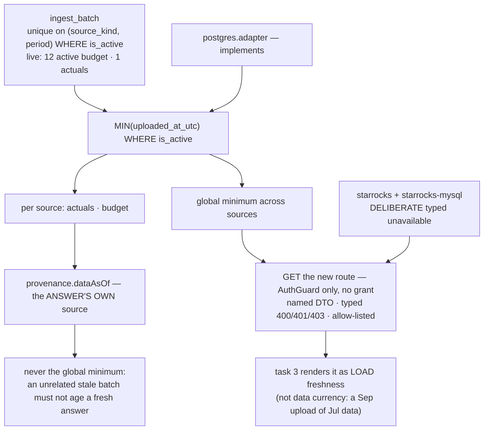

# Task plan — shell-freshness-api: define load freshness and serve it

Story: `poc-responsiveness` · Task 2 of 3 · **user_facing: false** · backend only

## Objective
The shell's top bar shows a permanently disabled `Freshness unavailable` chip, and every answer's
`provenance.dataAsOf` has always been `null`. Both have the same cause: nothing computes freshness.
This task **defines** it and serves it; the pill itself is task 3.

## Acceptance criteria (plan_contracts)
- **t-sfa-c1** — a new port method: the oldest `uploaded_at_utc` across **active** ingest batches.
- **t-sfa-c2** — Postgres implements it; both starrocks adapters return a **typed unavailable**.
- **t-sfa-c3** — a new authenticated route under decision **0019**, allow-listed, `AuthGuard` only.
- **t-sfa-c4** — `provenance.dataAsOf` is **deliberately untouched** and stays null (**D-0041**).
- **t-sfa-c5** — hermetic leaves plus a **gated** DB proof with a dead-port control; D-0006.

## What already exists (grounding, file:line)
- `backend/src/warehouse/postgres.adapter.ts:56` — `freshness()` returns **null** when no column is
  supplied, and **no domain declares one**, so freshness is null everywhere today.
- `backend/src/warehouse/warehouse.interface.ts:15` — `freshness(goldObject, column?)` is
  **domain-scoped** and returns `MAX(column)`. This task needs a **cross-source MINIMUM** over
  `ingest_batch`, which that signature cannot express.
- `backend/src/warehouse/warehouse-schema.ts:24` — `ingest_batch` carries `sourceKind`, `period`,
  `uploadedAtUtc`, `isActive`; the unique index is on **`(source_kind, period)`**, so many batches
  are active at once. **Live warehouse right now: 12 active budget batches, 1 actuals.**
- `backend/src/chat/chat.service.ts:426` — `dataAsOf: await this.selectionExecutor.freshness(domain)`,
  which is why provenance has always been null.
- `backend/src/mis/mis-selection.controller.ts:33-46` — the 0019-compliant route pattern: `@Get`,
  `@ApiOperation`, named response DTO, typed 400/401/403.
- `backend/src/app.routes.test.ts:32` — the strict allow-list.
- `.prettierignore` — `backend/src/warehouse/postgres.adapter.ts` is ignored (**D-0006**).

## Workflow

## Manual Verification
1. Sign in and call the new route: it returns the oldest active `uploaded_at_utc` across sources.
   Cross-check against
   `select source_kind, min(uploaded_at_utc) from ingest_batch where is_active group by source_kind`
   — the route's global value must equal the **smaller** of the two.
2. Confirm the payload names it **load** freshness, not data currency.
3. Ask a data question and confirm `provenance.dataAsOf` is **still `null`** — this task does not
   populate it (D-0041), so a reviewer seeing null is seeing the contract honoured.
4. Sign in as a user without the `report` grant: the route still answers (it is `AuthGuard` only),
   because the shell chrome must not 403 for someone who can legitimately sign in.
5. Gated proof on the host via `npm --prefix backend run test:warehouse-proof` (it SETS
   `WAREHOUSE_DB_TEST=1`; a bare run would skip) with several active periods present, plus the
   dead-port control — the proof must FAIL against a dead port.
6. `npm run build:contract && npm run build:backend && npm run typecheck && npm run lint &&
   npm run format:check && npm run test:hermetic` — four required leaves, each confirmed by its
   junit testcase **name** and **executed count**, never the exit code (D-0024, D-0031).

## What the grill changed (nine findings, all verified)
- **A required port method would have broken the build.** **Fourteen** files implement `Warehouse`,
  most of them typed test fakes outside this scope — so the new method is **optional**. (I had also
  called the interface `WarehouseAdapter`; it is `Warehouse`.)
- **The route had no name.** `app.routes.test.ts` matches exact strings and task 3 cannot consume an
  unnamed payload, so it is now **`GET /api/warehouse/freshness`** with a discriminated body that
  keeps five states apart — a value, no active batches, unsupported engine, unconfigured warehouse,
  lookup failure — none collapsing to null.
- **The gated proof would have SKIPPED.** A bare `junit-run` without `WAREHOUSE_DB_TEST=1` skips,
  and `stage done` rejects a skipped leaf. It now runs under that flag and belongs to
  `test:warehouse-proof`.
- **The DB proof must assert per-source values *and* the overall minimum**, with several active
  periods — a one-batch-per-source fixture passes while the query is wrong.
- **The allow-list alone cannot prove C3** — the leaf now proves `AuthGuard` with no
  `RequireAction`, plus the named DTO and typed Swagger responses.
- **D-0006 covers all three adapters**, not just Postgres.
- **A service needs its interface** per the constitution's service-interface rule.
- **`provenance.dataAsOf` is deliberately untouched (D-0041).** "The answer's own source" is
  undefined for a percentage answer reading both Actuals and Budget, and the field is rendered today
  as "Data as of" — filling it with load time would show a September upload of July figures as
  September data.

## Out of scope
The pill itself and the dock (task 3). Period-scoped or report-scoped freshness — the chip is
global; per-report currency belongs to the report. Changing the existing domain-scoped
`freshness()` seam, which other callers still use.

<!-- forge:contract -->
## Contract (recorded)

Rendered by the harness from the recorded decomposition; edit the decomposition, not this block. It is excluded from the plan's approval and grill digests, so a re-render never stales either.

**Objective.** Give the shell something true to show. Freshness returns null everywhere today because postgres.adapter.ts:56 returns null when no freshness column is supplied and no domain declares one, so provenance.dataAsOf has always been null too. Define load freshness as the oldest uploaded_at_utc among ACTIVE ingest batches across governed sources - active batches are unique per (source_kind, period), so many are active and the value must be scoped to load time, not period - implement the port for Postgres with a deliberate typed unavailable on both starrocks adapters, and serve it from a new authenticated route under decision 0019. Backend only.

**Acceptance criteria**

- A new OPTIONAL method on the Warehouse port (backend/src/warehouse/warehouse.interface.ts:9 - the interface is named Warehouse, not WarehouseAdapter) reports LOAD FRESHNESS from active ingest batches. It MUST be optional: FOURTEEN files implement Warehouse, most of them typed test fakes outside this task's scope, and adding a REQUIRED method breaks every one of them and fails typecheck before a line of behaviour is written. The method returns, per governed source, the oldest uploaded_at_utc among rows where is_active is true, AND the overall minimum across sources. The existing freshness(goldObject, column?) at :15 cannot express this: it is domain-scoped and returns MAX(column), while this is a cross-source MINIMUM over ingest_batch. Active batches are unique per (source_kind, period), so many are active at once - the live warehouse holds 12 active budget batches and 1 actuals - which is why it is a minimum over ACTIVE batches and why it is LOAD freshness, never data currency: a September upload of July figures must not be announced as 'data as of September'.
- Postgres implements it; both starrocks adapters return a DELIBERATE, TYPED UNAVAILABLE rather than throwing, guessing, or being left unimplemented. The payload distinguishes the states a caller must tell apart - a value, NO ACTIVE BATCHES, an engine that does not report freshness, an unconfigured warehouse, and a lookup failure - so none of them silently collapses to null, which the spec forbids. Under D-0006 ALL THREE adapters are prettier-ignored and baseline-pinned - postgres.adapter.ts, starrocks.adapter.ts and starrocks-mysql.adapter.ts, not only Postgres - so each one this task edits is formatted, removed from .prettierignore, and has its quality-gate baseline entry removed in the SAME change.
- GET /api/warehouse/freshness serves it - an EXACT path, because backend/src/app.routes.test.ts matches exact strings and task 3 cannot consume an unnamed route. It follows decision 0019 as mis-selection.controller.ts:33-46 does: unversioned api/... path, raw typed body, a NAMED response DTO, and documented Swagger 400/401/403. It is added to the strict allow-list, which must fail on an UNEXPECTED route as well as a missing one. It sits behind AuthGuard ONLY with NO RequireAction grant: the shell chrome renders for every authenticated user, so a grant would 403 the pill for someone who can legitimately sign in, and the payload carries no governed value - only when data was loaded. The service is introduced with its INTERFACE alongside it, per constitution/pnp-coding-standards-modular-monolith.md's service-interface rule.
- provenance.dataAsOf is NOT touched by this task - human-decided 2026-09-14 and recorded as D-0041. It stays null. Two reasons the cold read established: both governed domains combine Actuals AND Budget while chat.service.ts:426 passes only a DomainSpec, so 'the answer's own source' is undefined for a percentage answer reading both; and contract/src/api.ts:470 is already rendered to users as 'Data as of', so filling it with LOAD time would present a September upload of July figures as September data, and relabelling reaches the report path (reports.service.ts:45) beyond this task. The shell route is the whole of this task's surface.
- The behaviour is proven by hermetic leaves AND a gated host proof that actually executes. The allow-list leaf proves more than presence: that the route is behind AuthGuard with NO RequireAction, and that the named success DTO and typed 400/401/403 Swagger responses exist - the allow-list alone cannot prove C3. A second hermetic leaf proves both starrocks adapters return the typed unavailable. The DB-backed proof is registered in backend/package.json test:warehouse-proof, which SETS WAREHOUSE_DB_TEST=1 - a bare junit-run without that flag SKIPS, and stage done rejects a skipped leaf, which is the false-green this project has already been burned by. It asserts BOTH the per-source oldest timestamps AND their overall minimum with SEVERAL active periods present for a source, since a one-batch-per-source fixture would pass while the query is wrong, and is demonstrated on the host with a DEAD-PORT NEGATIVE CONTROL. New test files are registered in backend/package.json and tools/quality-gate.test.mjs in exactly one group. Every artifact is judged by its junit testcase NAME and EXECUTED count, never an exit code (D-0024, D-0031).

**Write scope** (what `stage done` measures the diff against)

- backend/src/warehouse/warehouse.interface.ts
- backend/src/warehouse/postgres.adapter.ts
- backend/src/warehouse/starrocks.adapter.ts
- backend/src/warehouse/starrocks-mysql.adapter.ts
- backend/src/warehouse/freshness.adapters.test.ts
- backend/src/warehouse/load-freshness.db.test.ts
- backend/src/warehouse/freshness.interface.ts
- backend/src/warehouse/freshness.service.ts
- backend/src/warehouse/freshness.controller.ts
- backend/src/warehouse/freshness.dto.ts
- backend/src/warehouse/warehouse.module.ts
- backend/src/app.module.ts
- backend/src/app.routes.test.ts
- contract/src/api.ts
- backend/package.json
- tools/quality-gate.test.mjs
- .prettierignore

**Required tests** (run by `stage done`)

- `the freshness route is allow listed behind auth guard with no action grant and documents its typed responses` -- `TS_NODE_PROJECT=backend/tsconfig.json TS_NODE_TRANSPILE_ONLY=1 node tools/junit-run.mjs --file {path} --name {id} --report {report} --require ts-node/register` (backend/src/app.routes.test.ts)
- `both starrocks adapters report a typed unavailable rather than guessing or throwing` -- `TS_NODE_PROJECT=backend/tsconfig.json TS_NODE_TRANSPILE_ONLY=1 node tools/junit-run.mjs --file {path} --name {id} --report {report} --require ts-node/register` (backend/src/warehouse/freshness.adapters.test.ts)
- `the postgres load freshness returns per source oldest active uploads and their overall minimum across several active periods` -- `WAREHOUSE_DB_TEST=1 TS_NODE_PROJECT=backend/tsconfig.json TS_NODE_TRANSPILE_ONLY=1 node tools/junit-run.mjs --file {path} --name {id} --report {report} --require ts-node/register` (backend/src/warehouse/load-freshness.db.test.ts)

**Verify commands**

- `npm run build:contract`
- `npm run build:backend`
- `npm run typecheck`
- `npm run lint`
- `npm run format:check`
- `npm run test:hermetic`

**Review budget.** 17 files / 1500 lines -- An optional port method across three adapters with a deliberate typed unavailable on two, a discriminated payload that keeps five caller-visible states apart, a new authenticated route with its service interface, named DTOs, Swagger contracts and allow-list registration under 0019, three required leaves including a gated warehouse proof that must actually execute with a dead-port control, and D-0006 formatting across three prettier-ignored adapters. No UI, and provenance is untouched under D-0041.
<!-- /forge:contract -->
