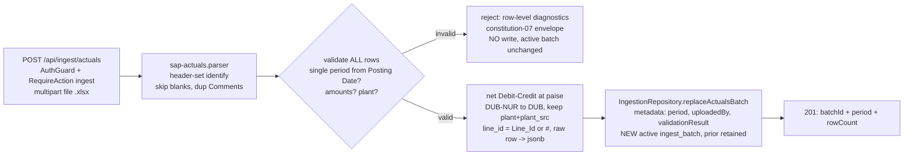

# Task plan — actuals-loader

## Context
Add `POST /api/ingest/actuals`: parse the SAP Base Report, net Debit−Credit at paise, apply the
DUB-NUR→DUB plant normalization, retain the FULL raw row + original AND canonical keys, and replace
idempotently per period via a NEW active `ingest_batch` — REUSING the warehouse write path built in
warehouse-schema (`backend/src/warehouse/ingestion.repository.ts`
`IngestionRepository.replaceActualsBatch` + `createWarehouseWritePool` + `createWarehouseDb`). The SAP
Base Report is the **`SAP Report` sheet inside `SAP Entries Mapping.xlsx`**
(`docs/context/2026-08-20-srihari-phase1-data/`): 4,113 July-2026 lines, header row = row 3 after two
blank rows, columns `#, Transaction Number, Line_Id, Posting Date, Month, Plant, Cost Center, MIS GL
Code, AcctName, Debit, Credit, ShortName, ContraAct, LineMemo, Comments, Comments (dup), Origin,
Reference 1, Loc.`. Raw nursery Plant is **`DUB-NUR`** (88 lines; NO `DUB` in raw); the mapping
(`Sheet1`) is keyed on canonical Plant `DUB`. Grounding: decisions 0004 (no pre-join), 0013
(observability), 0014 (PoC no master), 0015 (warehouse snake_case). Backend-only.

## Write scope
- `backend/src/ingest/` — `ingest.module.ts`, `ingest.controller.ts`, `ingest.service.ts`,
  `ingest.schemas.ts`, `sap-actuals.parser.ts`, `plant-mapping.ts`, `ingest.controller.test.ts`,
  `ingest.service.test.ts`, `sap-actuals.parser.test.ts`.
- `backend/src/warehouse/warehouse-schema.ts` (+ `backend/drizzle-warehouse/` new migration) — the ONE
  warehouse change: an additive `raw` jsonb column on `sap_transaction` (read-only port untouched).
- `backend/src/db/migrate.ts` (seed `ingest` grant to `admin`), `backend/src/app.module.ts` (wire
  IngestModule), `backend/src/app.routes.test.ts` (allow-list), `backend/src/grants/grants.constants.ts`
  (add `ingest`), `backend/package.json` (exceljs + test wiring), `package-lock.json`,
  `tools/quality-gate.test.mjs`, `contract/src/api.ts`.
- NOT `postgres.adapter.ts` / `warehouse.interface.ts` (read-only port, unchanged); the write
  pool/repository/atomic-flip are REUSED unchanged.

## Decisions (tooling — conduct §9)
- **Grant:** add `"ingest"` to `GRANT_ACTIONS` (admin/save/pin) AND seed `{role:"admin", action:"ingest"}`
  in `db/migrate.ts baseRolePerms` so the grant is obtainable after a normal migrate; guard
  `@UseGuards(AuthGuard)` + `@UseGuards(RequireAction("ingest"))`.
- **Raw retention (human-decided):** add a `raw` jsonb column to `sap_transaction` via a NEW additive
  migration (`backend/drizzle-warehouse/0001_*.sql`, generate-once/apply-only via `warehouse:migrate`)
  storing the WHOLE source row (incl. ShortName, both Comments, Origin, Loc.) for later drill-down;
  extend the hermetic `warehouse-schema.test.ts` for the new column.
- **Source identity (human-decided):** `line_id` = SAP `Line_Id` when present, else the SAP `#` row
  number — 298 rows (incl. 6 nursery) have blank `Line_Id` but a unique `#`; keeps `line_id` NOT NULL +
  `UNIQUE(batch_id,txn_no,line_id)` and lets the full July load succeed.
- **Upload:** `multipart/form-data` via `FileInterceptor`; field name **`file`**, exactly one `.xlsx`, a
  byte cap (**15 MB**) and row cap (**25,000**), **413** on exceed; reject other content types with the
  constitution-07 envelope.
- **Parser lib:** `exceljs` (NEW dep → `package-lock.json`); identify the sheet by its REQUIRED HEADER
  SET (not file/sheet name), tolerating leading blank rows and the duplicate `Comments` header.
- **Period:** derived as first-of-month from **`Posting Date`** (the `Month` cell is only `"Jul"` — a
  display token; validate its consistency but never parse the period from it); require EVERY row to
  match the single period.
- **Money:** `Actual = Debit − Credit` at PAISE as `numeric(18,2)` STRINGS end to end (never JS float);
  read exceljs number cells without float drift.
- **Validation:** validate EVERY row (headers present, single period, parseable amounts/date, nonblank
  plant) BEFORE any write; a mixed-period/invalid file → row-level diagnostics `{row, column, message}[]`
  and NO write (the repository transaction is never opened).
- **Normalization:** `plant-mapping.ts` `canonicalPlant(src)` maps `DUB-NUR → DUB` (documented constant —
  the only nursery rule; accept every other nonblank plant unchanged, NO catalogue/allow-list per 0014;
  the full Sheet1 mapping is governed-joins, out of scope); `plant` = canonical, `plant_src` = original.
- **Response:** typed `IngestActualsResponse` (`{batchId, period, rowCount}`) returned RAW (match
  saved/pins — there is NO success-envelope wrapper in this codebase); zod-validated.
- **Idempotency:** `replaceActualsBatch(metadata, rows)` — NEW active batch, prior retained; "no
  duplicate rows" = unique WITHIN a batch (`UNIQUE(batch_id,txn_no,line_id)` + whole-file-per-period
  grain); across batches rows intentionally repeat.

## Workflow

## Approach
1. **Schema:** add `raw jsonb` to `sap_transaction` (warehouse-schema.ts) + a committed `0001_*.sql`
   migration; extend `warehouse-schema.test.ts`.
2. **Grant:** add `"ingest"` to `GRANT_ACTIONS`; seed it to `admin` in `db/migrate.ts`.
3. **Contract/DTO:** `contract/src/api.ts` adds `IngestActualsResponse` + a diagnostics shape;
   `ingest.schemas.ts` zod-validates.
4. **Parser:** `sap-actuals.parser.ts` — exceljs buffer load, find the sheet by required header set, map
   columns by header, skip blank leads, tolerate dup `Comments`; parse amounts to paise strings; derive
   period from Posting Date; source identity = `Line_Id || #`; carry the raw row.
5. **Mapping:** `plant-mapping.ts` `canonicalPlant` (DUB-NUR→DUB else identity).
6. **Service:** parse → validate-ALL → on success own the pool lifecycle + `replaceActualsBatch` exactly
   once with `{period, uploadedBy, validationResult, reconciliationResult:{}}`; on any invalid row return
   diagnostics with NO write.
7. **Wiring:** `IngestModule` in `app.module.ts`; add `POST /api/ingest/actuals` to the
   `app.routes.test.ts` allow-list.
8. **Tests:** hermetic `ingest.controller.test.ts` (allow-list, AuthGuard, CSRF-less 403, missing-`ingest`
   403, multipart DTO/Swagger), `sap-actuals.parser.test.ts` (header identify, blank-row + dup-Comments,
   single-period from Posting Date, paise net, `Line_Id || #`, DUB-NUR→DUB, raw row, all-rows-before-
   write), `ingest.service.test.ts` (validate-before-write, NO repo call on invalid, exactly ONE
   `replaceActualsBatch` with uploader metadata — repository mocked). A `WAREHOUSE_DB_TEST=1`-gated test
   (in ONE suite — `ingest.service.test.ts`, hermetic otherwise) proves live idempotent replace + paise
   net against docker warehouse-db. Fixtures only — NEVER bundle the 639KB workbook.

## Grill resolutions (one cold read; applied to this plan + the contract)
1. Blank `Line_Id` (298 rows incl. 6 DUB-NUR) → HUMAN: `line_id = Line_Id || #` (the SAP row number is a
   unique immutable source identity); no schema nullable change. 2. "All source + drill fields" → HUMAN:
   add a `raw jsonb` column (additive migration) storing the whole row. 3. Period → from `Posting Date`
   first-of-month, `Month` token is display-only. 4. "Known plant" → accept all nonblank plants, only
   DUB-NUR→DUB (0014 no-master, no allow-list). 5. Mapping → DUB-NUR→DUB documented constant, not a
   dynamic Sheet1 read (full mapping = governed-joins). 6. Grant unobtainable → seed `ingest` to `admin`
   in db/migrate.ts (write_scope +). 7. Writer metadata incomplete → full `CandidateBatchMetadata`
   (uploadedBy/validationResult/reconciliationResult) + pool lifecycle. 8. Multipart underspecified →
   field `file`, 1 file, 15 MB, 25k rows, 413. 9. HTTP envelope → raw typed response (matches saved/pins;
   no success envelope here); global error envelope carries diagnostics. 10. Service unproven → add
   `ingest.service.test.ts` (validate-before-write, one repo call) + name the gated DB test's suite/leaf.
   11. `package-lock.json` absent from scope → added (exceljs must `npm ci`). 12. "No duplicate rows" →
   scoped to unique WITHIN a batch.

## Acceptance criteria
1. POST /api/ingest/actuals is guarded by AuthGuard + a new 'ingest' RBAC action grant and is added to the strict route allow-list, with a typed multipart DTO, Swagger success/error/auth docs, and CSRF/forbidden tests
2. the loader identifies the sheet by its required HEADER set (not file/sheet name), requires a single posting month, validates ALL rows before any write, and rejects invalid/mixed-period files with row-level diagnostics and NO change to the active batch
3. each row nets Actual = Debit - Credit at paise and applies the DUB-NUR->DUB normalization from the provided SAP Entries Mapping.xlsx; raw lines + original AND canonical keys are retained linked to a new ingest_batch
4. a re-upload of a period is idempotent: a new ingest_batch becomes active and the prior batch is retained (not erased), with no duplicate rows

## Reviewer focus
REUSE the warehouse write path (replaceActualsBatch, createWarehouseWritePool, createWarehouseDb) — no
re-implementing the pool/atomic flip, no touching the read-only adapter/interface. ONE warehouse change:
the additive `raw jsonb` column + its migration. `ingest` grant added AND seeded to admin; guarded +
allow-listed + CSRF/forbidden tested. Header-identified parse (dup `Comments` + blank leads tolerated),
period from Posting Date, ALL rows validated before ANY write. Money `Debit − Credit` at paise strings
(never float). `line_id = Line_Id || #`. DUB-NUR→DUB constant, plant + plant_src retained, no
allocation/join/mutation (0004). Idempotent per-period replace, prior retained, unique within batch.
Hermetic tests use fixtures (no DB, not the 639KB xlsx); the DB idempotency proof is a
WAREHOUSE_DB_TEST=1-gated test in ONE suite (D-0008 demonstrated host evidence).

## Verify
- `python3 factory/scripts/verify.py` green (structure, typecheck, quality, tests incl. test:hermetic).
- `required_tests`: `ingest.controller.test.ts`, `sap-actuals.parser.test.ts`, `ingest.service.test.ts`.
- Demonstrated evidence (D-0008): host-run idempotent replace + paise net against docker warehouse-db.

## Manual Verification
1. `docker compose up -d warehouse-db`; `WAREHOUSE_PG_* npm --prefix backend run warehouse:migrate` (now
   includes the raw-column migration).
2. Start the API; obtain an `admin` session (seeded `ingest` grant); `POST /api/ingest/actuals` with a
   small `SAP Report`-shaped fixture .xlsx (one July month, a DUB-NUR row, a blank-`Line_Id` row) →
   201 `{ batchId, period: "2026-07-01", rowCount }`.
3. `SELECT plant, plant_src, line_id, debit, credit, raw FROM sap_transaction WHERE batch_id=<id>` → the
   nursery row shows `plant='DUB'`, `plant_src='DUB-NUR'`; the blank-`Line_Id` row shows `line_id` = its
   `#`; `raw` holds the full source row; `actual_by_key_month` nets Debit−Credit at paise.
4. Re-POST the same period → NEW active batch, prior retained, gold view reflects only the new batch, no
   duplicates.
5. POST a mixed-period/malformed file → 400 with row-level diagnostics, NO change to the active batch.
6. `python3 factory/scripts/verify.py` → Verification passed.
