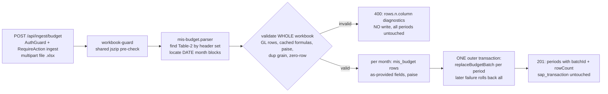

# Task plan — budget-loader

## Context
Add `POST /api/ingest/budget` to load the Nursery MIS Format workbook into `mis_budget` as a
SEPARATE object — stored as-provided, no derived allocation, no mutation of SAP actuals (decision
0004) — with atomic per-period batch replace. This EXTENDS the `backend/src/ingest` module built in
actuals-loader (same `IngestModule` / `IngestController` / `IngestService`; same `ingest` grant; same
multipart + zod + DTO patterns) and REUSES `IngestionRepository.replaceBudgetBatch`
(`backend/src/warehouse/ingestion.repository.ts`). Source: `docs/context/2026-08-20-srihari-phase1-data/
Nursery MIS Format.xlsx`, sheet `MIs Format`, **Table-2 Financial MIS** (rows 479–588): a TWO-ROW header
— row 479 carries `S. No.`, `Budget Components`, `Rollover (Y/N)`, `Payment Office`, col F `GL Codes`,
then period-group labels; row 480 carries the sub-columns. Period groups: YTD / FY blocks (annual —
skipped) and the **month blocks** whose row-479 header is a first-of-month DATE (the real workbook has
twelve, `2026-04-01` … `2027-03-01`), each with sub-columns **`Budget | Roll Over Budget | Actual | %`**.
GL LINE rows (S.No `1.1`, nonblank GL in col F) carry the budget; component GROUP rows (no GL) are
skipped. The rollover cells are FORMULAS with cached results (e.g. `=X482` → `0`). Grounding: decisions
0004 (no pre-join), 0014 (PoC no master), 0015 (warehouse snake_case). Backend-only.

## Write scope
- `backend/src/ingest/` — `ingest.controller.ts` (+ `POST /api/ingest/budget`), `ingest.service.ts`
  (+ `ingestBudget`), `ingest.schemas.ts`, NEW `workbook-guard.ts` (the jszip guard extracted so both
  parsers share one implementation), `sap-actuals.parser.ts` (ONLY to import the shared guard), NEW
  `mis-budget.parser.ts` + `mis-budget.parser.test.ts`, `ingest.controller.test.ts`, `ingest.service.test.ts`.
- `backend/src/app.routes.test.ts` (allow-list), `contract/src/api.ts` (`IngestBudgetResponse`),
  `backend/package.json` + `tools/quality-gate.test.mjs` (register the new parser test in ONE suite).
- NOT: a new module, grant, migration, dependency, or `backend/src/warehouse/*` change;
  NOT `sap_transaction` / `actual_by_key_month` (never read, written, or joined — 0004).

## Decisions (tooling — conduct §9)
- **Endpoint:** second method on the existing `IngestController`, `@UseGuards(AuthGuard)` +
  `@UseGuards(RequireAction("ingest"))`; multipart via `FileInterceptor` (field `file`, one `.xlsx`, 15 MB
  compressed cap, 25,000-row cap, 413 on exceed); the shared `workbook-guard.ts` jszip pre-materialization
  guard (256 entries / 256 MB uncompressed). Response `IngestBudgetResponse` returned RAW:
  `{ formatId, plant, periods: Array<{ period, batchId, rowCount }>, totalRowCount }` — an explicit
  per-period association, never parallel arrays.
- **Table identification:** by the REQUIRED HEADER SET (`S. No.`, `Budget Components`, `GL Codes` on the
  row-479 header) — not sheet name or row number; month blocks by their DATE headers, sub-columns matched
  EXACTLY (`Budget`, `Roll Over Budget`, `Actual`, `%`, whitespace-normalized). Handle EVERY date-headed
  block present (twelve in the real workbook, two in a fixture) — never assume a count.
- **Fields (as provided, nothing derived):** `format_id` = `nursery-mis-financial-v1`; `period` = the
  block's date; `line_id` = the S.No text; `gl_code` = col F text; `cost_center` = the `Budget Components`
  text AS PROVIDED (an opaque MIS label; the SAP cost-centre mapping is governed-joins scope);
  `budget_amount` = `Budget`, `rollover_amount` = `Roll Over Budget`, both at PAISE as `numeric(18,2)`
  strings. `Actual` and `%` are IGNORED.
- **Cell semantics:** numeric cells read directly; a FORMULA cell is accepted ONLY via its cached numeric
  result (`cell.value.result`) rounded to paise — a formula with NO cached result or an error result is a
  row DIAGNOSTIC, never blank/`0.00` (that would be silent financial corruption); a genuinely blank cell is
  `0.00`; string amounts validated on the RAW grouped-decimal form before stripping commas; iterate only
  resolved header column indices.
- **Preflight (all before ANY write, each a `rows.<n>.<column>` 400):** duplicate
  `(format_id, period, line_id, gl_code, cost_center)` grain within the upload; a GL line row missing its
  S.No or Budget Components; a workbook with ZERO GL line rows; any non-numeric or uncached amount.
- **Isolation (human-decided, PoC-scoped):** the active key is `(source_kind='budget', period)` — one
  nursery MIS format + one plant (DUB) makes that the effective isolation; `format_id` and plant are
  row/metadata attributes (plant recorded in `validation_result`), not part of the switch. Multi-format /
  multi-plant isolation (a schema-key change) is DEFERRED with a revisit trigger.
- **Batches + atomicity:** the period trigger forces `mis_budget.period = ingest_batch.period`, so one
  upload = one budget batch per present month block. The service opens ONE outer warehouse transaction
  (`db.transaction`), constructs `new IngestionRepository(transaction)` — the repository accepts a
  transaction as its db exactly as `proveWarehouse` does — and calls `replaceBudgetBatch` once per period
  INSIDE it (nested savepoints): a failure on any later period rolls back every earlier one; each period's
  prior budget batch is RETAINED.

## Workflow

## Approach
1. **Shared guard:** extract the jszip pre-materialization guard from `sap-actuals.parser.ts` into
   `workbook-guard.ts`; both parsers import it (actuals parser changes only to import).
2. **Contract/DTO:** `contract/src/api.ts` adds `IngestBudgetResponse`; `ingest.schemas.ts` zod-validates.
3. **Parser:** `mis-budget.parser.ts` — guarded exceljs load, find the Table-2 header row by required
   set, map fixed columns + every date-headed month block (+ its four exact sub-columns), iterate GL line
   rows, apply the cell semantics + preflight rules, emit `MisBudgetInput[]` per period.
4. **Service:** `ingestBudget(file, uploadedBy)` → parse → validate-all → on success open ONE outer
   transaction, `new IngestionRepository(transaction)`, `replaceBudgetBatch` per period with
   `{ period, uploadedBy, validationResult (plant DUB, counts), reconciliationResult: {} }`; any invalid
   cell returns diagnostics with NO write.
5. **Wiring:** controller method + Swagger; add `POST /api/ingest/budget` to the allow-list; register
   `mis-budget.parser.test.ts` in `test:hermetic` + quality-gate (ONE suite).
6. **Tests:** hermetic `ingest.controller.test.ts` (+budget allow-list, guard, CSRF-less 403,
   missing-grant 403, DTO), `mis-budget.parser.test.ts` (header-set id, DATE-block detection with two
   blocks, YTD/FY skipped, group vs GL rows, `Actual`/`%` ignored, `Roll Over Budget` matched, formula
   cached result accepted / uncached rejected, blank→0.00, paise, dup-grain / missing-S.No / zero-row
   rejections), `ingest.service.test.ts` (validate-all-before-write, NO repo call on invalid,
   per-period `replaceBudgetBatch` inside one transaction, a later-period failure rolls back earlier
   ones, `sap_transaction` never touched — repository mocked). A `WAREHOUSE_DB_TEST=1`-gated leaf in
   `ingest.service.test.ts` (ONE suite) proves the live multi-period replace + retention + rollback +
   no-actuals-mutation. Fixtures only — never the 397KB workbook.

## Grill resolutions (one cold read; applied to this plan + the contract)
1. Isolation key impossible → HUMAN: PoC-scope to `(budget, period)`; format/plant are row/metadata
   attributes; multi-plant isolation deferred. 2. `Roll Over` vs the real `Roll Over Budget` header →
   exact whitespace-normalized sub-column names. 3. "Exactly twelve" vs a two-month fixture → handle every
   date-headed block present. 4. Formula semantics → accept cached numeric results only; uncached/error
   = diagnostic, never 0.00. 5. Cross-period atomicity asserted → specified: one outer `db.transaction`
   + `new IngestionRepository(transaction)` (the `proveWarehouse` pattern) + a rollback test. 6. Missing
   preflight → dup grain / missing S.No-or-component / zero GL rows / uncached amounts all rejected before
   any write. 7. No runnable D-0008 command → the exact host command is pinned in the contract, this plan
   and tests.json. 8. No shared guard seam → extract to `workbook-guard.ts` (write_scope +) used by both
   parsers. 9. Ambiguous response → explicit `periods[{period, batchId, rowCount}]`. 10. Drift →
   `replaceBudgetBatch` lives in `ingestion.repository.ts`. (`cost_center` holds the MIS component label
   as-provided — an opaque label for the PoC, not a SAP cost centre.)

## Acceptance criteria
1. POST /api/ingest/budget uses the same AuthGuard + 'ingest' grant + allow-list + typed DTO/Swagger/CSRF pattern as the actuals endpoint
2. the MIS format workbook loads into mis_budget as a SEPARATE object, stored as-provided with NO derived allocation and NO mutation of SAP actuals (decision 0004)
3. a budget upload replaces only its (format/period/canonical plant) atomically via a new active budget ingest_batch; the prior budget batch is retained

## Reviewer focus
Extend, don't rebuild: same module/controller/service/grant/multipart/zod patterns as actuals; reuse
`replaceBudgetBatch`; the jszip guard extracted ONCE to `workbook-guard.ts` for both parsers; no new
module, grant, migration, dependency, or warehouse change. Table-2 by header set; every DATE-headed month
block present (YTD/FY skipped); GL line rows only; exact `Roll Over Budget`; `Actual`/`%` ignored; every
field as provided; paise strings; formula cells ONLY via cached results (uncached = diagnostic). Whole-
workbook preflight before ANY write; per-period replaces inside ONE outer transaction with proven
rollback; prior batches retained; `(budget, period)` is the PoC isolation key (human-decided);
`sap_transaction` never touched (0004). Hermetic tests on fixtures; the DB proof is a
WAREHOUSE_DB_TEST=1-gated leaf in ONE suite with a pinned host command (D-0008).

## Verify
- `python3 factory/scripts/verify.py` green (structure, typecheck, quality, tests incl. test:hermetic).
- `required_tests`: `ingest.controller.test.ts`, `mis-budget.parser.test.ts`, `ingest.service.test.ts`.
- **D-0008 pinned host command** (demonstrated evidence, recorded in tests.json):
  `WAREHOUSE_PG_HOST=127.0.0.1 WAREHOUSE_PG_PORT=5433 WAREHOUSE_PG_USER=warehouse WAREHOUSE_PG_PASSWORD=warehouse-local WAREHOUSE_PG_DATABASE=warehouse PGHOST=127.0.0.1 PGPORT=5432 WAREHOUSE_DB_TEST=1 node --require ts-node/register --test backend/src/ingest/ingest.service.test.ts`

## Manual Verification
1. `docker compose up -d warehouse-db`; `WAREHOUSE_PG_* PGHOST=127.0.0.1 PGPORT=5432 npm --prefix backend run warehouse:migrate`.
2. Start the API; obtain an `admin` session; `POST /api/ingest/budget` with a small Table-2-shaped
   fixture .xlsx (two GL line rows, one group row, TWO month blocks, a rollover formula with a cached
   result) → 201 `{ formatId, plant: "DUB", periods: [{ period, batchId, rowCount }, …], totalRowCount }`.
3. `SELECT period, line_id, gl_code, cost_center, budget_amount, rollover_amount FROM mis_budget` → one
   row per GL line × month, `cost_center` = the Budget Components text, amounts at paise;
   `SELECT count(*) FROM sap_transaction` unchanged.
4. Re-POST the same workbook → a NEW active budget batch per period, the prior batches remain
   (retained), no duplicates within a batch.
5. POST a workbook with an uncached formula or a duplicate GL line → 400 with `rows.<n>.<column>`
   diagnostics and NO change to any period's active batch.
6. Run the D-0008 pinned host command → the gated leaf passes; `python3 factory/scripts/verify.py` → passed.
