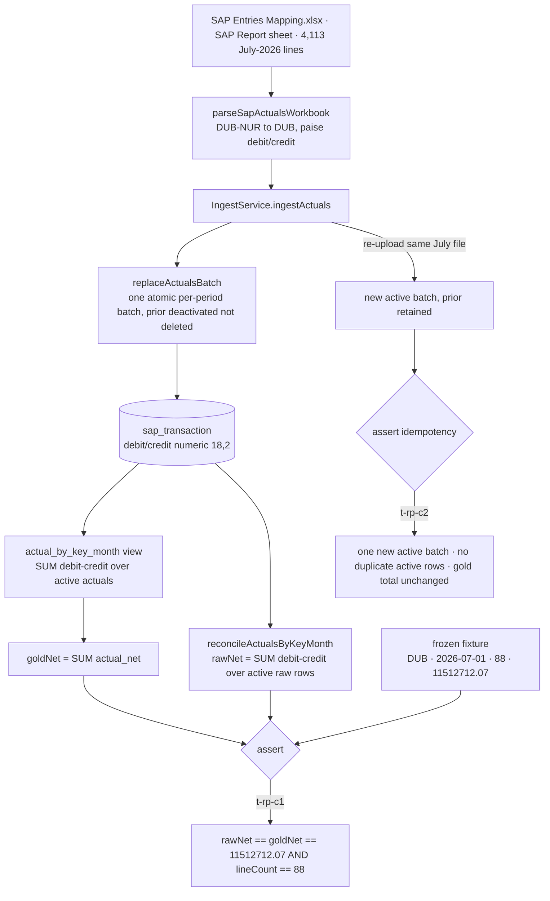

# Task plan — reconciliation-proof: July DUB reconciliation + idempotency proof

Story: sap-ingestion · Task: reconciliation-proof (task 4 of 4, FINAL) · user_facing: false

## Objective

Prove — with a demonstrated warehouse-DB test against a frozen in-repo fixture —
that the ingested July-2026 DUB actuals net to **EXACTLY ₹11,512,712.07 (paise)**
both across the accepted raw `sap_transaction` rows and through the
`actual_by_key_month` gold view, and that re-uploading the same July DUB actuals
replaces the month idempotently (one new active batch, prior batch retained, no
duplicate active rows, no double-counting in the gold view). This closes the
sap-ingestion story: the numbers a later MIS statement will display are grounded
to source, paise-exact, and stable under re-upload.

This is a PROOF task. It adds **no** endpoint, grant, migration, warehouse-schema
change, or dependency. It reuses the shipped stack end to end.

## Acceptance criteria (plan_contracts)

- **t-rp-c1** — a demonstrated warehouse-DB test grounds the July DUB net to
  EXACTLY ₹11,512,712.07 (paise) across the accepted raw `sap_transaction` rows
  AND the `actual_by_key_month` gold view, against a frozen in-repo reconciliation
  fixture. (source: docs/decisions/0014-sap-ingestion-poc-no-master.md)
- **t-rp-c2** — re-uploading the July DUB actuals replaces that month with no
  duplicate rows and no double-counting in the gold view (idempotency), with the
  prior batch retained. (source: plans/active/sap-ingestion-ingest-sap-actuals-budgets.md)

## What already exists (reuse, do not re-create)

- `backend/src/warehouse/warehouse-schema.ts` — `sap_transaction` (numeric(18,2)
  `debit`/`credit`, `month`, canonical `plant`, `batch_id`), `ingest_batch`
  (active-pointer partial-unique on `(source_kind, period) WHERE is_active`), and
  the `actual_by_key_month` view: `SUM(debit-credit)::numeric(18,2) AS actual_net`
  over `sap_transaction JOIN ingest_batch WHERE source_kind='actuals' AND is_active`,
  grouped by plant/cost_center/gl_code/month.
- `backend/src/ingest/sap-actuals.parser.ts` — `parseSapActualsWorkbook`
  (canonical `DUB-NUR → DUB`, period from Posting Date, paise `debit`/`credit`).
- `backend/src/ingest/ingest.service.ts` — `IngestService.ingestActuals` (the
  shipped path; strips the derived `actual`, writes `debit`/`credit`).
- `backend/src/warehouse/ingestion.repository.ts` — `replaceActualsBatch`
  (atomic per-period replace, `pg_advisory_xact_lock`, prior batch deactivated
  not deleted, chunked inserts) and the `new IngestionRepository(txnOrDb)` /
  `createWarehouseWritePool` / `migrateWarehouse` test harness.
- The gated-leaf pattern to mirror EXACTLY: `backend/src/ingest/ingest.service.test.ts`
  (`{ skip: process.env.WAREHOUSE_DB_TEST !== "1" }`, `migrateWarehouse()` +
  `IngestService` + raw `pg` pool assert on docker `warehouse-db` 127.0.0.1:5433).

## Grounding

`docs/context/2026-08-20-srihari-phase1-data/SAP Entries Mapping.xlsx`, sheet
`SAP Report` (header row 3): 4,113 July-2026 lines; the nursery `DUB-NUR` is
88 lines mapping to canonical plant `DUB`, netting ₹11,512,712.07 for 2026-07.
The `.07` paise figure is asserted in prose only (decision 0014 + the plan) — THIS
task computes it from the real workbook and freezes it. Decisions: 0004 (no
pre-join / no derived allocation — reconciliation is actuals-only, never touches
mis_budget), 0009 (required_tests name a real leaf + pin TS_NODE_PROJECT — the
false-green guard this task honours), 0014 (PoC no master; Σ(Debit−Credit) July
DUB = ₹11,512,712.07), 0015 (warehouse snake_case). D-0008 = demonstrated host
evidence (the warehouse DB test is gated and run host-side, not by verify.py).

## Design

### 1. Reconciliation query module — `backend/src/warehouse/reconciliation.repository.ts` (role-suffixed per constitution pnp-coding-standards; DB I/O = repository)
A small READ-ONLY helper over an injected pg pool (the `createWarehouseWritePool`
/ `TransactionHost` pattern — never its own pool, never a write):

```
reconcileActualsByKeyMonth(db, { plant, period }) ->
  { plant, period, rawNet, goldNet, lineCount }
```
- `rawNet` = `SUM(debit - credit)` over `sap_transaction txn JOIN ingest_batch b
  ON b.id = txn.batch_id WHERE b.source_kind='actuals' AND b.is_active AND
  txn.plant = $1 AND txn.month = $2`, returned as a paise-exact **numeric(18,2)
  string** (cast/serialize in SQL — never parsed into a JS float).
- `goldNet` = `SUM(actual_net)::numeric(18,2)` over `actual_by_key_month WHERE
  plant=$1 AND month=$2`, also a paise-exact string.
- `lineCount` = `COUNT(*)` of the contributing active raw rows.
- Plus `loadReconciliationExpectation(path)` reading the frozen fixture and
  rejecting an `expectedNetPaise` that is not a strict `/^-?\d+\.\d{2}$/` string.

### 2. Frozen fixture — `backend/src/warehouse/__fixtures__/july-dub-reconciliation.json`
```
{ "plant": "DUB", "period": "2026-07-01",
  "source": "SAP Entries Mapping.xlsx#SAP Report",
  "lineCount": 88, "expectedNetPaise": "11512712.07" }
```
The number is the REAL computed net. If the real workbook nets a different paise
value, the fixture carries the real value and the discrepancy is a finding —
never force the data to `.07`.

### 3. Hermetic unit test — `backend/src/warehouse/reconciliation.repository.test.ts` (in test:hermetic)
On a small synthetic case (constructed rows / mocked pool — NO real 639KB xlsx):
`reconcileActualsByKeyMonth` returns `rawNet === goldNet ===` the constructed
total as paise strings with the right `lineCount`; only ACTIVE actuals rows count
(an inactive prior batch and a budget batch are excluded); the fixture loader
rejects a non-paise expected string.

### 4. D-0008 gated proof — a `{ skip: WAREHOUSE_DB_TEST !== "1" }` leaf inside reconciliation.repository.test.ts (ONE suite)
**Isolation (deterministic, disposable dev DB):** `migrateWarehouse()` only APPLIES
migrations — it does NOT clear rows, and the docker `warehouse-data` volume
persists — so at the START of the leaf TRUNCATE `ingest_batch` + `sap_transaction`
(CASCADE) to a clean slate. The `warehouse-db` on 127.0.0.1:5433 is the disposable
local dev DB used only for these host proofs; never assert on pre-existing state.

Then: read the REAL `SAP Entries Mapping.xlsx` host-side → `parseSapActualsWorkbook`
→ `IngestService.ingestActuals` → open a raw pool via `createWarehouseWritePool`
and assert:
- **t-rp-c1**: `reconcileActualsByKeyMonth(pool,{plant:'DUB',period:'2026-07-01'})`
  has `rawNet === goldNet === '11512712.07'` (== fixture.expectedNetPaise) AND
  `lineCount === 88` (== fixture.lineCount).
- **whole-upload integrity** (not just the 88 DUB rows): the active `(actuals,
  2026-07)` batch's TOTAL `sap_transaction` row count equals the parsed row count
  (all 4,113), and `(txn_no, line_id)` is unique across the whole active batch —
  so a duplicate or dropped row anywhere outside DUB cannot hide behind the DUB total.
- **t-rp-c2** (idempotency): ingest the SAME July file again → assert exactly one
  NEW active `(actuals, 2026-07)` batch, the prior batch RETAINED (`is_active=false`,
  its rows still present), NO duplicate active rows, the whole-upload row count and
  `(txn_no,line_id)` uniqueness still hold for the new active batch, and the gold
  total UNCHANGED (still `11512712.07` — no double-count).

**Authoritative proof:** this gated leaf IS the authoritative demonstrated July-DUB
reconciliation evidence (recorded in tests.json with the pinned command, committed
reviewer-visible per decisions 0009 + D-0008). It is distinct from `npm run
warehouse:proof`, which stays warehouse-schema's synthetic structural seed proof —
this task does NOT edit `warehouse-migrate.ts` or `warehouse:proof`.

Pinned host command (the `TS_NODE_PROJECT`+`TS_NODE_TRANSPILE_ONLY` prefix is
MANDATORY — without it `node --test <file.ts>` loads the file as one empty
false-passing testcase; proven by a dead-port negative control that FAILS the
gated leaf):
```
TS_NODE_PROJECT=backend/tsconfig.json TS_NODE_TRANSPILE_ONLY=1 \
WAREHOUSE_PG_HOST=127.0.0.1 WAREHOUSE_PG_PORT=5433 WAREHOUSE_PG_USER=warehouse \
WAREHOUSE_PG_PASSWORD=warehouse-local WAREHOUSE_PG_DATABASE=warehouse \
PGHOST=127.0.0.1 PGPORT=5432 WAREHOUSE_DB_TEST=1 \
node --require ts-node/register --test backend/src/warehouse/reconciliation.repository.test.ts
```

### 5. Wiring
Register `reconciliation.repository.test.ts` in `backend/package.json` `test:hermetic`
(the gated leaf self-skips there) and in `tools/quality-gate.test.mjs` if it
enumerates the suite.

## Workflow — the end-to-end flow this task proves

This task adds no runtime path; it PROVES the shipped actuals path reconciles.
The flow it exercises and asserts:



This task STARTS by TRUNCATE-ing `ingest_batch`+`sap_transaction` on the disposable
dev warehouse (migrate only applies migrations, it does not clear rows) to a
deterministic clean slate, then ingests the real July workbook; it STOPS at the
committed assertions (paise-exact reconciliation across raw rows + gold view,
whole-upload row-count/uniqueness integrity, and idempotent replace). It changes
no ingestion behaviour — a failure here is a defect in the already-shipped path,
surfaced by this proof.

## Manual Verification

1. Ensure docker `warehouse-db` is up: `docker compose up -d warehouse-db`
   (published on 127.0.0.1:5433). Observe: `docker ps` shows it healthy.
2. Run the gated proof host-side with the pinned command above (the
   `TS_NODE_PROJECT`/`TS_NODE_TRANSPILE_ONLY` prefix + `WAREHOUSE_DB_TEST=1`).
   Observe: the reporter shows every leaf run — `tests N / pass N / fail 0 /
   skipped 0`, including the reconciliation + idempotency leaves.
3. Negative control: rerun the same command with `WAREHOUSE_PG_PORT=5599` (a dead
   port). Observe: the gated leaves FAIL with `ECONNREFUSED` (proving they truly
   connect and the pass in step 2 is real, not a false-pass).
4. Confirm the frozen fixture is honest: open
   `backend/src/warehouse/__fixtures__/july-dub-reconciliation.json` and confirm
   `expectedNetPaise` = `11512712.07` and `lineCount` = `88`. Observe: these are
   the exact values the step-2 assertions matched, so the committed expectation
   equals the demonstrated result.
5. Run `npm run test:hermetic`. Observe: it passes and the reconciliation gated
   leaf is SKIPPED there (it runs only under `WAREHOUSE_DB_TEST=1`).

## Decisions attested
(verified against `./forge decision list --active`)
- **0004-pulse-governed-joins** — no pre-join / no derived allocation; reconciliation
  is ACTUALS-ONLY, mis_budget never read or joined.
- **0009-required-tests-real-name-and-tsproject** — required_tests name real leaves and
  the gated command pins `TS_NODE_PROJECT` (the false-green guard).
- **0014-sap-ingestion-poc-no-master** — the ₹11,512,712.07 July-DUB target.
- **0015-warehouse-snake-case-deviation** — the warehouse schema this reconciles over.
- **D-0008** named honestly: the reconciliation proof is a committed, reviewer-visible
  gated DB test run host-side, not verify.py evidence.

## Note — story-plan sheet drift (settled by the repo)
The approved story plan `plans/active/sap-ingestion-ingest-sap-actuals-budgets.md`
refers to a "New SAP" / Sheet1 actuals source. The SHIPPED, already-merged parser
identifies its required header set only on the **`SAP Report`** sheet (header row 3);
Sheet1/Sheet4 do not satisfy it. `SAP Report` is therefore the settled source (this
task and the merged actuals-loader both use it); the story-plan prose is stale and
does not change this task. Ledgered as a lesson so downstream stories inherit the
correct sheet.

## Surface impact
- Data: none (read-only reconciliation queries; no schema/migration).
- API/ops: none (no endpoint, grant, or dependency).
- Tests/docs owned: reconciliation.repository.ts, reconciliation.repository.test.ts, the frozen fixture,
  package.json test:hermetic wiring, quality-gate enumeration.

## Out of scope
Any new schema/migration/endpoint/grant/dependency; any budget (mis_budget)
read/write/join (0004); the query-time budget⋈actual governed join (governed-joins)
and drill-down UI (drill-down); statement display (mis-statement).
