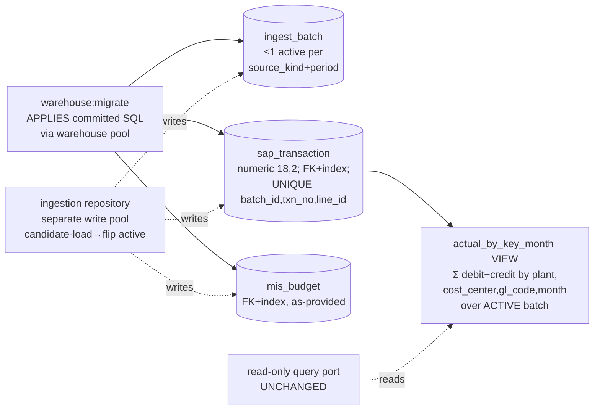

# Task plan — warehouse-schema

## Context
Build the ingest/DDL layer on the SEPARATE warehouse Postgres (`config.ts warehouse{}` from
`WAREHOUSE_PG_*`; docker `warehouse-db` on `127.0.0.1:5433`, db `warehouse`). Today
`backend/src/warehouse/postgres.adapter.ts` + `warehouse.interface.ts` are a **read-only** query port;
there is no write pool, no `warehouse:migrate`, no SAP tables. This task adds a SEPARATE write path +
the schema the loaders and reconciliation will use. Backend-only. Grounding:
`docs/architecture/30-financial-mis-build-plan.md:70-84`, `constitution/pnp-database-standards.md`,
decisions 0004 (no pre-join), 0014 (PoC no master), **0015 (warehouse snake_case deviation)**.

## Write scope
- `backend/src/warehouse/warehouse-schema.ts` (Drizzle warehouse schema), `ingestion.repository.ts`
  (write pool + repository), `warehouse-migrate.ts` (apply-only runner), `warehouse-schema.test.ts`.
- `backend/drizzle-warehouse.config.ts` + `backend/drizzle-warehouse/` (committed migration SQL).
- `backend/package.json` (`warehouse:migrate` script), `backend/src/config.ts` (fail-fast warehouse
  connection guard), `tools/quality-gate.test.mjs` (pin the new test), `docker-compose.yml` (if the
  `warehouse-seed` step needs the migration).
- NOT the read-only `postgres.adapter.ts` / `warehouse.interface.ts` (unchanged).

## Decisions (tooling — conduct §9)
- **Naming:** snake_case tables/columns + `*_utc` timestamps per **decision 0015** (warehouse-scoped
  deviation); audit columns, explicit FK indexes, `numeric(18,2)` money still apply.
- **Migration:** Drizzle (existing dep) via a separate `backend/drizzle-warehouse.config.ts`; the
  migration SQL is **generated once and committed**; `warehouse:migrate` **only applies** it against
  the warehouse pool (a `ts-node` runner mirroring `src/db/migrate.ts`) — it never regenerates.
- **Write pool:** a dedicated warehouse `pg.Pool`, separate from the read-only adapter; **fail-fast**
  if `WAREHOUSE_PG_*` is unset/misdirected (never create tables in the wrong DB).
- **Batch grain:** one upload = ONE whole-file batch per `(source_kind, period)` (all plants);
  `canonical_plant` is a ROW attribute, not a batch key (client Q1). Re-upload atomically loads a
  candidate batch then flips `is_active` in one transaction — at most one active per key.
- **Gold:** `actual_by_key_month` is a **plain view** (not matview) over the ACTIVE actuals batch.

## Workflow

## Approach
1. **Drizzle warehouse schema (snake_case):** `ingest_batch(id, source_kind, period,
   uploaded_by TEXT, uploaded_at_utc, row_count, validation_result, reconciliation_result,
   is_active)` with a **partial unique index** on `(source_kind, period) WHERE is_active` (at most one
   active) + a `source_kind` CHECK; `sap_transaction(batch_id FK, txn_no, line_id, posting_date,
   month, plant, plant_src, cost_center, gl_code, acct_name, contra_account, debit numeric(18,2),
   credit numeric(18,2), memo, reference, created_at_utc)` with `UNIQUE(batch_id, txn_no, line_id)`
   and index `(month,plant,cost_center,gl_code)`; `mis_budget(batch_id FK, format_id, period, line_id,
   gl_code, cost_center, budget_amount numeric(18,2), rollover_amount numeric(18,2))`.
2. **`actual_by_key_month` view** (migration SQL): `SUM(debit − credit) AS actual_net` grouped by
   `plant, cost_center, gl_code, month` over `sap_transaction` joined to the ACTIVE actuals batch —
   named output columns `(plant, cost_center, gl_code, month, actual_net)`.
3. **Write pool + ingestion repository:** a dedicated warehouse `pg.Pool` + methods for the loaders
   (create candidate batch, bulk-insert rows, atomically flip active) — importable; does not touch the
   read-only adapter; fail-fast on unset `WAREHOUSE_PG_*`.
4. **`warehouse:migrate`:** applies the committed `backend/drizzle-warehouse/` SQL via the warehouse
   pool (generate happened once at authoring).
5. **Hermetic test** (`warehouse-schema.test.ts`): import the schema module and assert the tables
   (snake_case columns, `numeric` money, the ≤1-active partial unique index, `UNIQUE(batch_id,txn_no,
   line_id)`, FK indexes) and the view's named columns, with NO DB; register in `test:hermetic` +
   `tools/quality-gate.test.mjs`.

## Grill resolutions (one cold read; applied to this plan + the contract)
1. drizzle config → `backend/drizzle-warehouse.config.ts` added to scope. 2. write_scope narrowed to
new files (read-only adapter/interface excluded). 3. `warehouse:migrate` applies committed SQL only
(generate once). 4. `verify_commands` now include `npm run test:hermetic`. 5. exact demonstrated seed
fixture (below), not "two rows". 6. ≤1-active + atomic candidate-load→flip + source_kind CHECK +
`month` as first-of-month date. 7. batch grain = one whole-file batch per `(source_kind, period)`
(client Q1). 8. `contra_account` added + `UNIQUE(batch_id,txn_no,line_id)` prevents double-count;
`mis_budget` grain defined; view columns named. 9. snake_case per **decision 0015** (recorded
deviation). 10. `uploaded_by` is a TEXT app-user id (no cross-DB FK) + fail-fast on unset
`WAREHOUSE_PG_*`. 11. decisions 0014/0015 attested here (the approved story-plan header predates them).

## Acceptance criteria
1. a reproducible warehouse:migrate creates ingest_batch, sap_transaction, mis_budget on the SEPARATE warehouse Postgres via a dedicated write pool/ingestion repository that does NOT alter the read-only Warehouse query port
2. ingest_batch enforces at most one active batch per (source_kind, period) with immutable batch metadata and an atomic candidate-load-then-switch; sap_transaction stores money as numeric(18,2) paise, carries a source-line unique identity (txn_no,line_id per batch) so duplicate input rows cannot double the gold total, and is indexed on (month,plant,cost_center,gl_code) and batch_id
3. actual_by_key_month is a plain view over the ACTIVE actuals batch returning Sum(debit-credit) at paise grouped by (plant,cost_center,gl_code,month), proven over seeded rows

## Reviewer focus
snake_case per 0015 (audit/indexes/`numeric(18,2)` still apply); do NOT modify the read-only
adapter/interface; `warehouse:migrate` applies committed SQL only; a separate write pool with a
fail-fast guard; ≤1-active per `(source_kind,period)` via a partial unique index + atomic flip;
`UNIQUE(batch_id,txn_no,line_id)`; the view's named columns. No semantic-domain registration
(governed-joins). No loader/API yet.

## Verify
- `python3 factory/scripts/verify.py` green (structure, typecheck, quality, tests incl. test:hermetic).
- `required_tests`: `backend/src/warehouse/warehouse-schema.test.ts` (schema shape, hermetic, no DB).
- Demonstrated evidence (D-0008): `warehouse:migrate` against docker `warehouse-db`, then a fixed seed
  fixture (below) proves active-batch filtering + `actual_net` aggregation.

## Manual Verification
1. `docker compose up -d warehouse-db` (127.0.0.1:5433).
2. `WAREHOUSE_PG_HOST=127.0.0.1 WAREHOUSE_PG_PORT=5433 WAREHOUSE_PG_USER=warehouse
   WAREHOUSE_PG_PASSWORD=warehouse-local WAREHOUSE_PG_DATABASE=warehouse npm --prefix backend run
   warehouse:migrate` → creates the tables + view.
3. Seed fixture (deterministic): one active `ingest_batch(source_kind='actuals', period='2026-07-01')`;
   two `sap_transaction` rows — `(DUB, CC1, 50001701, debit 100.50, credit 0.25, month 2026-07-01)`
   and `(DUB, CC1, 50001701, debit 10.00, credit 0.00, same month)`. Then
   `SELECT actual_net FROM actual_by_key_month WHERE gl_code='50001701';` → `110.25`.
4. Insert a second (inactive) candidate batch with different rows → the view total is unchanged
   (active-batch filtering); flip active → it reflects the new batch. No duplicate double-count.
5. `python3 factory/scripts/verify.py` → Verification passed.
