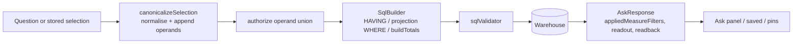

# Ask filters by a comparison between measures

2 parts · Risks: none one-way · New moving parts: none

## What changes for you

In scope (spec Behaviour, criteria C1–C10): the additive `measureFilters` shape on `Selection`;
one canonical ingress that normalises, appends operands and authorises the union at every door;
`HAVING` compilation in the governed-financial query and the statement projection, plus `WHERE`
dimension filters on the projection; totals over every matching group through a derived table
built by the SQL builder; validator acceptance with every existing check intact; selector tool
schema and prompt; parser; readback; `appliedMeasureFilters` on the response and the conversation
snapshot; saved queries, pins, identity and labels; the report-grounding merge; `viewInReport`
unavailable; help examples; the Ask answer's read-only readout line and empty state; the live
functional check.

Non-goals (spec Out of scope): editing a comparison in place; comparisons on `%` or on dimension
values; a variance measure or sorting by variance; any change to `/ask` routing, the causal guard,
the docked assistant's statement grounding, period semantics or the statement screen (0037, 0038,
ask-period-control); a heuristic word-scan guard.

## Why

"Show me list items where Actuals are more than the budget" returned every GL code with the
verified badge during the 2026-09-16 demo. The selection contract can only compare a dimension to
a value (`SelectionFilter`, `eq | in | neq` at `contract/src/measure.ts:160`), so the condition had
no shape: the selector's tool schema could not carry it, the SQL builder could not compile it, and
the model emitted the nearest expressible selection. Reproduced on 2026-09-17: `filters: []`, 67
rows, under-budget lines included. The cold reads found the same failure mode waiting in report
grounding (`chat.service.ts:638` rebuilds a selection from `filters` only), a pre-existing gap in
the statement projection (`sqlBuilder.ts:203` never reads `selection.filters`), and a second
ingress problem: a direct `AskRequest.selection`, a saved query, a pin, a prior turn and a grounded
selection all enter the backend without passing through the provider branch.

## Done when

1. **A question that compares one figure with another, or with an amount, carries that comparison through to the answer, and saved reports, pins and reopened answers keep it; nothing stored before this change is affected.**
2. **A comparison that cannot be honoured is refused with a stated reason, never silently dropped: only money figures compare, a figure never compares with itself, duplicates and malformed amounts are refused, and a figure the reader may not see is refused exactly as it is today.**
3. **The database itself applies the comparison, in both the GL view and the statement view, and the statement view now also honours a line filter it used to ignore.**
4. **Any figure a comparison relies on is shown as a column in the answer, added by the server, without changing the order of the rows.**
5. **Totals cover every line that passes the comparison, not only the page on screen.**
6. **Every existing safety check on generated SQL still fires with the new shapes, and an answer with no matching lines is a successful empty answer with a plain message.**
7. **The assistant's model is told the comparison shape and the rules for over budget, under budget, over 100% and lakh or crore, and it can only name figures that compare.**
8. **Answers, saved-report labels and the provenance readback spell the comparison out in words with Indian digit grouping, an empty result shows a message instead of a blank table, and the readout survives reopening a conversation.**
9. **"View in report" says the MIS statement cannot apply the comparison, and a question asked inside a report combines the report's comparisons with the question's.**
10. **A live check against Bedrock and the July warehouse proves the demo phrasings, at GL grain as the admin and at statement grain as a DUB-only user.**

## Risks

- **Bedrock is non-deterministic.** The prompt and schema make the filter expressible; whether the
  model emits it for a phrasing is proven live in the functional check, not hermetically. A
  phrasing that still comes back unfiltered is a prompt fix recorded as a lesson.
- **HAVING on text measures.** Refused by the helper before SQL; a leaf proves `%` never reaches
  the builder.
- **Derived-table totals and the validator.** The outer `LIMIT 1` satisfies the bounded-limit rule;
  a leaf pins `tableList` on the derived table so a parser upgrade cannot widen the allowlist.
- **Statement projection filters.** The `WHERE` predicate is emitted only when a filter is present;
  the golden statement proofs are asserted unchanged.
- **Ingress coverage.** A door that skips `canonicalizeSelection` reintroduces the bug; task 1's
  leaves enumerate every door and task 2's chat leaves assert the provider door.

## For the builders

Done-when items 1 to 6 are already on master: the foundation part (contract, canonical ingress,
authorization union, HAVING in both domains, derived totals) was built and merged under the
previous harness as pull request #74, so no row below covers them and the two remaining parts
build on it. Decision 0040 and the confirmed spec `docs/specs/ask-measure-comparison-filter.md`
stand. The previous harness's commands named in the Notes (`verify.py`, `./forge defer add`) no
longer exist: the test command is forge.toml's, and deferrals are plain notes here.

### Done-when details

1. (C1) `Selection.measureFilters` is an additive optional list of `{ measureId, op: gt|gte|lt|lte,
   compareTo: measure|value }`, combined with AND, order-preserving; `filters` is unchanged; the
   saved-query zod schema, the persisted turn type, the conversation answer snapshot and the Swagger
   DTOs accept it; every shipped leaf that builds or stores a selection passes unmodified.
2. (C2) One canonicaliser, `normalizeMeasureFilters`, runs at every ingress (provider output,
   direct `AskRequest.selection`, saved and pin store and reopen, prior-turn re-run, grounded
   selection) and refuses, through the single typed refusal `measure_filter_invalid` with its reason
   enum, a filter whose operand is not a money measure of the selection's domain or not a measure
   of that domain at all, compares a measure with itself, duplicates another entry, or carries a
   value outside `^-?\d+(\.\d{1,2})?$`; accepted values are normalised to two decimals. `%`
   measures are refused as not comparable. An operand outside the **user's permissions** is refused
   by the **existing displayed-measure path** (the operand union is what that path now reads), so a
   permission refusal looks exactly as it does today for a displayed measure. Every check that reads
   `measureIds` (validation, executor authorization, saved and pin runnable status, pin
   definition-version hash) reads the union with the operand measures. Leaves prove each site and
   that the three ingress kinds refuse identically.
3. (C3) The builder compiles each measure filter to `HAVING` over the verified expressions in both
   the governed-financial query and the statement projection, and the statement projection now also
   applies dimension filters as `WHERE` predicates; leaves assert the emitted SQL for
   measure-vs-measure, measure-vs-value, an ungrouped selection, the combination with a dimension
   filter and a time window, and a `leaf_key` filter on the projection, with the golden statement
   proofs unchanged.
4. (C4) Operand measures missing from `measureIds` are appended by the server, in first-appearance
   order, before validation, and appear in the returned selection and chips; the first measure and
   therefore the row ordering are unchanged.
5. (C5) `totals` are computed over every matching group via a derived table without the inner
   `LIMIT`; a leaf asserts, on a fixture with more matching groups than the limit, that the totals
   cover the groups beyond the visible page and differ from the unfiltered total.
6. (C6) The SQL validator accepts the new shapes and every existing check still fires: a `HAVING`
   or derived table that references an unapproved object or a blocked column is refused, and the
   mandatory bounded `LIMIT` check still fires. An answer whose `HAVING` drops every row is a
   successful empty answer with the stated wording.
7. (C7) The selector tool schema enumerates only comparable measure ids in `measureFilters`; the
   system prompt carries the mapping rules (over/under budget, over 100%, lakh/crore); the parser
   rejects malformed entries with a typed reason. Leaves assert schema, prompt text and parser
   behaviour against recorded provider outputs.
8. (C8) Saved-selection labels, the Ask answer's read-only readout line and the provenance
   readback render the comparison in words with registered labels and Indian digit grouping; a
   filtered result with no rows renders the empty-state message instead of a blank table; the
   readout survives a conversation reopen; `appliedMeasureFilters` is returned and snapshotted;
   selection identity includes the filter.
9. (C9) `viewInReport` is unavailable with the reason "The MIS statement cannot apply this
   comparison." when a measure filter is present; report grounding merges the report's and the
   question's `measureFilters` (report's first, identical normalised comparisons deduplicated, the
   rest ANDed in order); leaves prove a grounded over-budget question never returns the unfiltered
   report and that an identical entry on both sides yields one.
10. (C10) Functional check, live against Bedrock and the July warehouse, with two oracles because a
   GL code can fold into several statement components. GL grain, as the admin: "show me list items
   where Actuals are more than the budget for July 2026" returns only GL codes whose July actual
   exceeds July budget, with the readout `Actual > Budget · July 2026`, and the set equals the
   governed GL-month relation's over-budget set for July (the gated warehouse leaf); "which GL codes
   spent more than 5 lakh in July 2026" returns only codes above ₹5,00,000; "GL codes over 100% of
   budget for July 2026" returns the same codes as the first. The original no-period phrasing is
   also asked and its answer is asserted against its all-loaded scope, unchanged period semantics.
   Statement grain, as a DUB-only user: "which statement lines are over budget for July 2026"
   returns exactly the DUB statement rows whose `%` is above 100 or reads `over-budget`, every July
   budget being zero or positive.

## Tasks

| ID | Name | What it delivers | Covers | Scope | Tests | After | User-facing |
|---|---|---|---|---|---|---|---|
| MEASURE-FILTER-ASK-INTEGRATION | Measure comparison filters in Ask: selector schema and prompt, chat ingress and refusal, grounding merge, response and snapshot, Swagger, help, warehouse proof | Let the selector emit the comparison and let Ask carry it honestly: the Bedrock tool schema enumerates only comparable measure ids in measureFilters, the system prompt maps over/under budget, over 100% and lakh/crore onto the shape and sends anything else to mark_unsupported, the parser refuses malformed entries; for a grounded ask the comparable operands are every money measure of the report's domain the user is permitted (not only the report's displayed measures) so an Actual-only report can answer 'over budget'; the chat service canonicalises the provider's selection and a direct AskRequest.selection through the foundation helper, translates a MeasureFilterInvalidException into responseClass not_supported with a reader sentence per reason and the reason in the structured log line (no audit schema change), emits one chip of the existing kind 'filter' per measure filter, names the comparison in the readback, returns appliedMeasureFilters and snapshots it, marks viewInReport unavailable with the neutral reason, merges the report's and the question's measureFilters in report grounding with identical entries deduplicated, and answers an empty filtered result as a successful zero-row response with the stated message; the chat DTOs and Swagger document the fields; help lists comparison examples; a gated warehouse proof runs the over-budget selection against the July fixture. | 7, 9, 1 | `backend/src/llm/bedrock.provider.ts`, `backend/src/llm/bedrock.provider.test.ts`, `backend/src/llm/llm.constants.ts`, `backend/src/chat/chat.service.ts`, `backend/src/chat/chat.service.test.ts`, `backend/src/chat/chat.schemas.ts`, `backend/src/chat/chat.controller.ts`, `backend/src/conversations`, `backend/src/help`, `backend/src/swagger.test.ts`, `backend/src/warehouse/measure-filter.db.test.ts`, `backend/package.json` | `backend/src/llm/bedrock.provider.test.ts`, `backend/src/chat/chat.service.test.ts`, `backend/src/conversations/conversations.service.test.ts`, `backend/src/help/help.service.test.ts`, `backend/src/swagger.test.ts`, `backend/src/warehouse/measure-filter.db.test.ts` | none | no |
| MEASURE-FILTER-SURFACES | Render the comparison: labels, identity, the Ask answer readout line and empty state; live functional check | Consume the widened contract on the frontend: selection labels render each measure filter in words with registered labels and Indian digit grouping ('Actual > Budget', 'Actual > ₹5,00,000'); selection identity includes measureFilters; the Ask answer shows a read-only readout line under its title built from appliedMeasureFilters and the applied period, on a fresh answer and after a conversation reopen, and renders the empty-state message in place of the blank table when a filtered result has no rows; reopening a saved or pinned selection that carries a filter re-runs it with the filter. Vitest leaves for label, identity, readout, empty state and reopen. The story's functional check runs the executable matrix in the plan live against Bedrock and the July warehouse, as the admin and as a DUB-only user. | 8, 10 | `frontend/src/features/exploration/selection-label.ts`, `frontend/src/features/exploration/selection-label.test.ts`, `frontend/src/features/exploration/selection-identity.helper.ts`, `frontend/src/features/exploration/selection-identity.helper.test.ts`, `frontend/src/features/assistant` | `frontend/src/features/exploration/selection-label.test.ts`, `frontend/src/features/exploration/selection-identity.helper.test.ts`, `frontend/src/features/assistant/ask-panel.test.tsx` | MEASURE-FILTER-ASK-INTEGRATION | yes |
New moving parts: none

## Notes

Converted from plans/active/ask-measure-filter-ask-filters-by-a-comparison-between-measures.md by forge migrate.

### Technical Approach

### The shape (contract)
`contract/src/measure.ts` gains
```ts
export type MeasureFilterOp = "gt" | "gte" | "lt" | "lte";
export type MeasureFilterOperand = { kind: "measure"; measureId: string } | { kind: "value"; value: string };
export interface MeasureFilter { measureId: string; op: MeasureFilterOp; compareTo: MeasureFilterOperand; }
```
and `Selection.measureFilters?: MeasureFilter[]`. `contract/src/api.ts` gains
`AskResponse.appliedMeasureFilters?: MeasureFilter[]` and the same field on
`ConversationAnswerSnapshot`. `SEMANTIC_LABELS` is untouched; labels derive from measure labels.

### One canonical ingress (the seam)
A new pure helper `backend/src/semantic/measure-filter.helper.ts` (constitution suffix `helper`:
stateless, no IO) owns three functions:
- `normalizeMeasureFilters(domain, filters)` — literal grammar `^-?\d+(\.\d{1,2})?$`, two-decimal
  normalisation, comparability (`measure.format === "money"` on both sides), self-comparison and
  duplicate refusal, unknown measure refusal;
- `operandMeasureIds(selection)` — the union of `measureIds` and every operand measure id;
- `canonicalizeSelection(domain, selection)` — normalises, **appends** operand measures missing from
  `measureIds` in first-appearance order, and returns the canonical selection.

`canonicalizeSelection` runs at **every ingress** before anything persists, hashes, checks status
or queries: the provider's parsed output in the chat service, a direct `AskRequest.selection`, a
saved query and a pin on store and on reopen, a prior-turn re-run, and the grounded selection
after the report merge. Authorization then reads `operandMeasureIds`: `validateSelectionForUser`,
the executor's `authorize`, `saved.service.ts` / `pins.service.ts` runnable status and the pin
definition-version hash. A direct selection that names an operand the user may not read is
refused exactly as a displayed measure would be, and the appended operand is always visible.

### The refusal contract
Shape refusals are `MeasureFilterInvalidException`
(`backend/src/semantic/measure-filter-invalid.exception.ts`, constitution suffix `exception`),
which **extends `BadRequestException`** and carries `reason: MeasureFilterInvalidReason`
(`not_comparable | unknown_measure | self_comparison | duplicate | malformed_value`). An operand
outside the **user's permissions** is not a shape refusal: it follows the existing
displayed-measure path (`validateSelectionForUser`'s "Measure not available" and the executor's
`SelectionExecutionBlockedError`), which now reads the operand union, so it looks exactly as a
displayed-measure refusal does today. Two translation paths for the shape refusal, both proven by
leaves to carry the same reason:
- **Ask** (chat service): the exception is caught where the provider's `unsupported` branch is
  handled today and returned as `responseClass: not_supported` with a reader sentence per reason
  (for `not_comparable`: "I can't compare % with anything; compare Actual with Budget instead.");
  the reason is written to the structured log line the chat service already emits for a refused
  turn (no audit schema change: `writeResultEvent` keeps its columns).
- **Saved queries, pins, direct selections** (HTTP): the global exception filter
  (`global-exception.filter.ts:34`) hard-codes the non-500 message to "HTTP exception", so the
  envelope cannot carry the reason in `message`. Task 1 adds one branch to the filter: when the
  exception is a `MeasureFilterInvalidException`, `details` becomes `{ reason }` and `userMessage`
  the reader sentence; `code` stays `HTTP_400` and `type` is already the constructor name. A leaf
  in `error-envelope.wiring.test.ts` pins the envelope.

### SQL, built in one place (0004)
`sqlBuilder.ts` is the only SQL author. A private `havingClause` renders
`<expr> <op> <expr | lit(value)>` joined by ` AND ` after `GROUP BY` in `build` and after the
projection's grouping in `buildStatementProjection`; the projection additionally renders
`selection.filters` as `WHERE` predicates on `relation.<column>` beside the period predicate,
only when a filter is present. A new public `buildTotals(domain, selection, user, resolvedScope)`
returns the ungrouped totals query: unchanged from today's shape when `measureFilters` is empty,
and `SELECT <totals over the aliases> FROM (<grouped, filtered query with no LIMIT>) AS filtered
LIMIT 1` when it is not, so the validator's mandatory bounded top-level `LIMIT` still holds and
the inner query is proven to carry none. Over the derived table a money measure totals as
`SUM(<alias>)`; a `%` measure is a text `CASE`, not summable, so `MeasureSpec` gains an optional
`totalsOverAliases` expression (contract, additive) and the semantic layer sets it for
`governed-financial.percentage` and `mis-statement.percentage` to the same nil-rule `CASE` over
`SUM(actual)` and `SUM(budget)` aliases; a measure that is neither money nor declares one totals
as `NULL`. Leaves assert all three cases. `selectionExecutor.totalsFor` calls
`buildTotals`; it constructs no SQL. `sqlValidator.ts` gains no rule: leaves prove `HAVING` and
the derived table are accepted, that an unapproved object inside the derived table, a blocked
column inside `HAVING`, and a missing outer `LIMIT` are still refused, and pin that
`Parser.tableList` on the derived table returns the base objects.

### The selector
`bedrock.provider.ts`: `measureFilters` in the `emit_selection` schema with `measureId` and
`compareTo.measureId` enumerating comparable ids only, `op` the four operators, `value` a string;
`parseMeasureFilters` mirrors `parseFilters` with typed reasons in `llm.constants.ts`. The system
prompt gains `systemPromptMeasureFilters` (over / under budget, over 100%, lakh and crore, and the
`mark_unsupported` rule). The mock provider is unchanged.

### Grounded vocabulary
A grounded ask today offers the model only the report's own measures (`domainScopedToReport`,
`chat.service.ts:628`), which would leave Budget out of the comparison enum for an Actual-only
report. For a grounded ask the comparable operands are every money measure of the report's domain
the user is permitted; the canonicaliser appends the operand as usual. A leaf proves an
Actual-only report answers "over budget" with `Actual > Budget` and Budget appended.

### Surfaces
`ChatService.chips()` emits one chip of the existing kind `filter` per measure filter with the
words label, so the shipped `Chip` contract needs no new kind; `selection-label.ts` renders
`Actual > Budget` / `Actual > ₹5,00,000`; `selection-identity.helper.ts` compares
`measureFilters`; the readback gains "where <left> is greater than <right>";
`viewInReport` returns `{ available: false, reason: "The MIS statement cannot apply this
comparison." }` when a filter is present; `applyReportGroundingToSelection` merges the report's
`measureFilters` with the question's (report's first, identical normalised comparisons
deduplicated, the rest ANDed in order), a stated change to grounding merge semantics. Help's
`filterExamples` gains comparison examples. The Ask answer gains a read-only **readout line** under
its title (`Actual > Budget · July 2026`) and an **empty-state message** ("No lines match
Actual > Budget for July 2026") when a filtered result has no rows (human ruling, 2026-09-17).

### Rejected simpler shapes (0040)
A post-filter over returned rows (wrong under `LIMIT`) and a question-wording guard (answers
nothing). Both recorded in 0040.

### Decisions

- `docs/decisions/0040-ask-measure-comparison-filter.md` — accepted 2026-09-17. HAVING over
  verified expressions; money operands only, compared as amounts; operands made visible; totals
  follow the filter beyond the page; operands count for authorization; the statement projection
  honours dimension filters; a condition that cannot be expressed is refused, never dropped.
- Tooling: no new dependency. `node-sql-parser` (already vendored) parses `HAVING` and derived
  tables; zod (already used) extends the saved-selection schema. No migration: saved selections are
  JSON and the field is optional.
- Naming: fresh backend files follow the constitution suffix table (`measure-filter.helper.ts`,
  `measure-filter-invalid.exception.ts`); the vendored camelCase neighbours stay as decision 0012
  ledgers them.
- Contradicted lesson, deliberately: none. Honoured: the assistant-exploration-api lesson that
  runnable status must cover every measure the selection reads (here, the operand union).

### How each active decision is honoured
| Decision | How this plan honours it |
| --- | --- |
| 0004 governed joins, code-authored measures | The model names measure ids only; comparisons compile from `measure.expr`; `SqlBuilder` stays the sole SQL author (`buildTotals` lives there, not in the executor). |
| 0009 required tests real name + TS project | Every `required_tests` id is the leaf's `test("…")` string; commands pin `TS_NODE_PROJECT=backend/tsconfig.json TS_NODE_TRANSPILE_ONLY=1` through `tools/junit-run.mjs`. |
| 0012 / 0019 vendored house style | Fresh files use the constitution suffixes; routes stay unversioned `api/…` with raw typed bodies; DTOs and Swagger stay typed and documented. |
| 0013 handler and logging built | Refusals ride the existing global exception filter and structured logging; no new handler, no `console`. |
| 0027 Bedrock in ap-south-1 | Only the tool schema and system prompt change; the provider, region and model are untouched. |
| 0028 saves store the selection, re-authorise on reopen | `canonicalizeSelection` and the operand union run on reopen, so a revoked operand grant refuses rather than replays. |
| 0037 / 0038 Ask untouched, grounding frozen | `/ask` routing, the causal guard and the docked statement grounding are unchanged; only the report-grounding merge changes, stated in the spec. |
| ask-period-control (0033 lineage, spec) | A question naming no period still aggregates all loaded data; C10 qualifies its phrasings instead. |
| Others (0001–0003, 0005–0008, 0010, 0011, 0014, 0015, 0017, 0018, 0020–0026, 0029, 0032, 0034, 0036) | Not touched by this story: no ingestion, master, statement, drill, deployment or platform change. |

### Surface Impact

| Surface | Change | Owning task |
| --- | --- | --- |
| `contract/src/measure.ts`, `contract/src/api.ts` | **Changed** — additive `measureFilters`, `MeasureSpec.totalsOverAliases`, `appliedMeasureFilters` on response and snapshot | 1 |
| `measure-filter.helper.ts`, `measure-filter-invalid.exception.ts`, `selectionValidation.ts`, executor `authorize`, saved and pin status and hash, saved zod schema, `global-exception.filter.ts` (one branch) | **Changed** — canonical ingress, operand union, refusal envelope | 1 |
| SQL builder (both domains), `buildTotals`, `semanticLayer.ts` (`totalsOverAliases` on the two `%` measures), executor `totalsFor`, validator leaves | **Changed** — HAVING, derived totals, projection WHERE filters | 1 |
| `backend/package.json` (`test:hermetic` registration of the new helper test), `tools/quality-gate.test.mjs` | **Changed** — proof registration | 1 |
| Bedrock provider schema, prompt, parser; LLM messages; grounded vocabulary | **Changed** — `measureFilters` tool field and rules | 2 |
| Chat service: ingress call, refusal translation and log line, chips, readback, `viewInReport`, report-grounding merge, `appliedMeasureFilters`; conversations snapshot; chat DTOs and Swagger; help examples; warehouse proof | **Changed** | 2 |
| `backend/package.json` (`test:warehouse-proof` and `test:hermetic` registration of `measure-filter.db.test.ts`) | **Changed** — D-0008 proof registration | 2 |
| Frontend selection label, identity, Ask answer readout line and empty state | **Changed** | 3 |
| Tests: `measure-filter.helper.test.ts` (new), `sqlBuilder.selection.test.ts`, `sqlBuilder.statement.test.ts`, `sqlValidator.composed.test.ts`, `saved.service.test.ts`, `pins.service.test.ts` | **Changed** | 1 |
| Tests: `bedrock.provider.test.ts`, `chat.service.test.ts`, `conversations.service.test.ts`, `help.service.test.ts`, `swagger.test.ts`, `measure-filter.db.test.ts` (new, gated) | **Changed** | 2 |
| Tests: `selection-label.test.ts`, `selection-identity.helper.test.ts`, `ask-panel.test.tsx` | **Changed** | 3 |
| `/ask` routing, causal guard, docked grounding, period semantics, statement screen, mapping master, ingestion | **Unchanged by design** — 0037, 0038, ask-period-control; this story changes what a permitted selection can express, not who may ask what | — |
| Editing the comparison in place | **Deferred** — edit a measure filter in place (revisit when a reader asks to change a threshold without retyping) | — |
| Comparisons on `%` or on dimension values | **Deferred** — compare on % or dimension values (revisit when a question needs a ratio or a code-range comparison) | — |
| Variance measure and sorting by overrun | **Deferred** — variance measure (revisit when a question asks for biggest overruns) | — |
| `plans/roadmap.json` item `ask-measure-filter` | **Intake-owned** — added and marked active at intake, outside implementation; no task touches it | — |

### Task Decomposition

Three leaves, in dependency order (human ruling at the plan grill, 2026-09-17): a semantic and
query foundation, then the Ask integration, then the frontend surfaces. Every new field is
optional, so each build stays green at each step.

1. **`measure-filter-foundation`** (backend, `user_facing: false`) — C1 (contract and saved
   schema), C2, C3, C4 (the canonical append), C5, C6. The contract types incl.
   `totalsOverAliases`; the helper and the exception; the exception-filter branch; the operand
   union in validation, executor authorization, saved and pin status and hash; the builder's
   HAVING in both domains, the projection's WHERE filters, `buildTotals` with the `%` totals
   policy and the executor call; validator leaves; hermetic proof registration. Depends on nothing.
2. **`measure-filter-ask-integration`** (backend, `user_facing: false`) — C7, C8 (chips, readback,
   response and snapshot fields), C9, C1 (chat DTOs, Swagger, snapshot). Provider schema, prompt,
   parser and messages; the grounded comparison vocabulary; the chat service's ingress call,
   refusal translation and log line, chips, readback, `viewInReport`, report-grounding merge,
   `appliedMeasureFilters`; conversations snapshot; help examples; the gated warehouse proof (GL
   grain, totals beyond the page) and its `test:warehouse-proof` registration. Depends on task 1.
3. **`measure-filter-surfaces`** (frontend, `user_facing: true`) — C8 (labels, readout line,
   empty state), C1 (persisted turn consumers) and the story's functional check (C10). Depends on
   task 2. Loads and attests emil-design-eng and frontend-design.

### Verify Plan

- **Hermetic backend, task 1** — `measure-filter.helper.test.ts` (grammar, normalisation,
  comparability, self-comparison, duplicates, union, append order); `selectionValidation` leaves
  (operand outside domain or permissions refused); `sqlBuilder.selection.test.ts` (HAVING for
  measure-vs-measure, measure-vs-value, ungrouped, with a dimension filter and a time window;
  `buildTotals` without filters, with money-only measures, and with a `%` display measure whose
  total comes from `totalsOverAliases`); `error-envelope.wiring.test.ts` (the refusal envelope's
  `details.reason`); `sqlBuilder.statement.test.ts` (HAVING and `leaf_key`
  WHERE on the projection; unchanged when absent); `sqlValidator.composed.test.ts` (HAVING and
  derived table accepted; unapproved object inside the derived table, blocked column inside
  HAVING and missing outer LIMIT refused; `tableList` pinned); `saved.service.test.ts` and
  `pins.service.test.ts` (status and hash over the operand union; envelope
  `type: MeasureFilterInvalidException`).
- **Hermetic backend, task 2** — `bedrock.provider.test.ts` (schema enumerations, prompt text,
  parser against recorded outputs); `chat.service.test.ts` (ingress call on the provider and the
  direct door, refusal translated to `not_supported` with the reason in the log line, the filter
  chip, readback, `viewInReport`, grounding merge incl. the duplicate case, an Actual-only grounded
  report answering "over budget", `appliedMeasureFilters`, empty result); 
  `conversations.service.test.ts` (snapshot keeps the field); `help.service.test.ts`;
  `swagger.test.ts`.
- **Gated DB proof, task 2 (D-0008)** — `backend/src/warehouse/measure-filter.db.test.ts`,
  registered in `test:warehouse-proof`, loopback-only; executed on the host as
  `WAREHOUSE_DB_TEST=1 WAREHOUSE_DRIVER=postgres WAREHOUSE_PG_HOST=127.0.0.1 WAREHOUSE_PG_PORT=5433
  WAREHOUSE_PG_USER=warehouse WAREHOUSE_PG_DATABASE=warehouse npm -w @3f/backend run
  test:warehouse-proof` and, per leaf, `TS_NODE_PROJECT=backend/tsconfig.json
  TS_NODE_TRANSPILE_ONLY=1 WAREHOUSE_DB_TEST=1 node tools/junit-run.mjs --file <path> --name <id>
  --report <report> --require ts-node/register`; asserts the over-budget GL set for July equals the
  relation's and that totals cover matching groups beyond the page.
- **Frontend (vitest), task 3** — label, identity, readout line, empty state, reopen with filter.
- **Functional check, task 3 (story, user-facing), executable matrix:**

| # | Identity | Question | Expected |
| --- | --- | --- | --- |
| 1 | admin (all plants) | show me list items where Actuals are more than the budget for July 2026 | only GL codes whose July actual exceeds July budget; readout `Actual > Budget · July 2026`; set equals the warehouse leaf's over-budget set |
| 2 | admin | which GL codes spent more than 5 lakh in July 2026 | only codes with actual above ₹5,00,000; readout `Actual > ₹5,00,000 · July 2026` |
| 3 | admin | GL codes over 100% of budget for July 2026 | same set as #1 |
| 4 | admin | show me list items where Actuals are more than the budget | the same comparison over all loaded data; readout without a period; asserted against the relation with no time window |
| 5 | DUB-only user | which statement lines are over budget for July 2026 | exactly the DUB statement rows whose `%` is above 100 or reads `over-budget` |
| 6 | admin | GL codes over 100 crore in July 2026 | successful empty answer: "No lines match Actual > ₹1,00,00,00,000 for July 2026" |

- forge.toml's test command (npm ci, structural, typecheck, hermetic) on each task, run by forge close.

### Workflow


