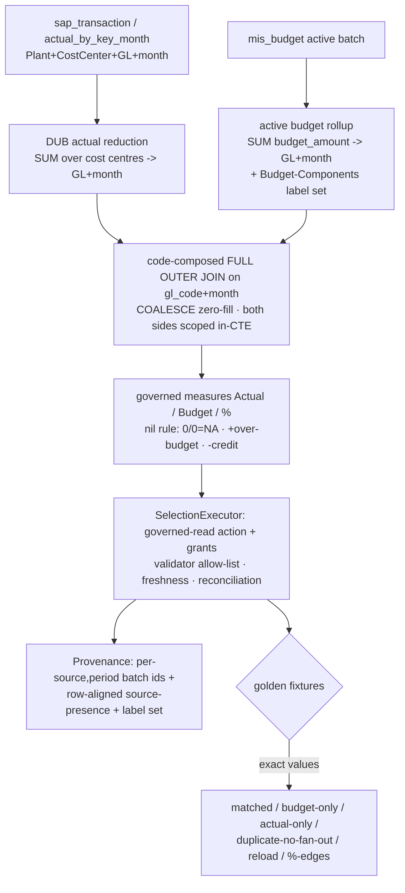

# Financial semantic layer + governed joins

## What changes for you

**In scope:** a **closed, typed, code-composed governed financial relation**
(Budget⋈Actual), code-authored **Actual / Budget / %** measures, GL+month active
rollups for **both** sides, **role-based** RBAC with the scope predicate inside
both join inputs, **golden-answer fixtures** proving no fan-out, and **provenance**
carrying per-(source,period) active batch ids + row-aligned source-presence.

**Non-goals (deferred, per 0016 / 0014):** the Budget-label → SAP cost-centre +
plant **mapping master** and allocation; the **Roll-over measure** (raw
`rollover_amount` is preserved untouched, but no semantic measure — pending
Srihari's rule); multi-plant / cost-centre-grain reporting; per-plant/region
**row-scoping** and asymmetric-RBAC policy; **LLM-/user-authored joins**; and the
report / drill-down / assistant **UI** (their own stories consume this layer).

## Why

3F needs `% = Actual ÷ Budget` where Actual (SAP) and Budget (MIS plan) are
separate, independently-revised objects. Decision 0004 requires ONE governed
semantic layer that composes measures across those objects so the report,
drill-down, and assistant read one source of truth. Today the code-authored
measure domains are empty (`backend/src/semantic/semanticLayer.ts:11`
`baseDomains = []`) and the SQL builder **rejects** cross-object composition
(`backend/src/sql/sqlBuilder.ts:29-32` throws). sap-ingestion landed the two
objects (`actual_by_key_month`, `mis_budget`) and deferred the Budget↔Actual
bridge here.

## Done when

1. A code-authored governed financial domain exposes **Actual**
   (`SUM(Debit − Credit)`), **Budget** (`SUM(budget_amount)`), and **%** measures
   over the two ingested objects — each read from its **active** batch only — and
   `%` follows the settled nil rule PLUS the negative case: `0/0` → NA/blank;
   `Actual>0, Budget=0` → over-budget (no %); `Actual<0, Budget=0` →
   **credit / negative actual** (no %). The LLM/runtime never authors the SQL.
2. Budget⋈Actual composes as **one closed, typed, code-composed, validated
   full-outer join on `(gl_code, month)` within DUB** that first reduces each side
   to `(gl_code, month)` (so there is **no fan-out**: DUB actuals are summed across
   cost centres before the join) and **zero-fills** the missing side; a golden
   fixture proves matched / Budget-only / Actual-only / duplicate-multi-line /
   reload-active-swap / %-edge (incl. negative-actual) cases with **exact** values.
3. **RBAC** is role-based: a governed-financial **read action** is required at the
   shared execution boundary along with the domain + Actual/Budget/% grants, and
   the scope predicate is injected **inside both source CTEs** (Actual scoped by
   plant; Budget scoped by its trusted derived constant `DUB`) before the join; a
   denial case and a predicate-placement test are included.
4. **Provenance** carries the measure definition + composed SQL PLUS active source
   **batch ids keyed by (source, period)** (correct for multi-month/YTD answers),
   **row-aligned** source-presence (matched / budget-only / actual-only, or a set
   for aggregate rows) and a deterministic **set** of informational Budget
   Component labels — all captured **within the same composed query** (no
   post-execution reload race).

## Tasks

| ID | Name | What it delivers | Covers | Scope | Tests | After | User-facing |
|---|---|---|---|---|---|---|---|
| GL-MONTH-ROLLUPS | GL+month active rollups for Actual (DUB) and Budget | Reduce both sides to one active row per (gl_code, month) BEFORE any join, so the later cross-object composition cannot fan out. |  | `backend/src/warehouse/warehouse-schema.ts`, `backend/drizzle-warehouse/0002_gl_month_rollups.sql`, `backend/drizzle-warehouse/meta/_journal.json`, `backend/src/warehouse/warehouse-schema.test.ts`, `backend/src/warehouse/gl-month-rollups.db.test.ts`, `backend/package.json`, `tools/quality-gate.test.mjs` | `backend/src/warehouse/warehouse-schema.test.ts` | none | no |
| COMPOSED-RELATION | Closed, typed, code-composed Budget⋈Actual relation with two-sided scope | Provide ONE governed financial gold relation that full-outer-joins the two GL+month rollups with zero-fill, serves every gold-object consumer, and enforces role-based access with the scope predicate inside both source CTEs. |  | `contract/src/measure.ts`, `backend/src/sql/sqlBuilder.ts`, `backend/src/sql/sqlBuilder.composed.test.ts`, `backend/src/sql/sqlValidator.composed.test.ts`, `backend/src/chat/selectionExecutor.ts`, `backend/src/chat/selectionExecutor.composed.test.ts`, `backend/src/grants/grants.constants.ts`, `backend/src/db/migrate.ts`, `backend/src/db/migrate.test.ts`, `backend/src/warehouse/composed-relation.db.test.ts`, `backend/package.json`, `tools/quality-gate.test.mjs` | `backend/src/sql/sqlBuilder.composed.test.ts`, `backend/src/sql/sqlValidator.composed.test.ts`, `backend/src/chat/selectionExecutor.composed.test.ts` | GL-MONTH-ROLLUPS | no |
| GOVERNED-DOMAIN-MEASURES | Code-authored Actual / Budget / % measures over the composed relation | Author the governed financial domain and its measures in code so report, drill-down and assistant share one definition; the LLM only selects measures. |  | `backend/src/semantic/semanticLayer.ts`, `backend/src/semantic/semanticLayer.financial.test.ts`, `backend/src/db/migrate.ts`, `backend/src/db/migrate.test.ts`, `backend/package.json`, `tools/quality-gate.test.mjs` | `backend/src/semantic/semanticLayer.financial.test.ts` | COMPOSED-RELATION | no |
| GOLDEN-PROVENANCE | Golden-answer fixtures (no fan-out) + provenance lineage | Gate correctness with exact golden fixtures and make every governed number reproducible and explainable. |  | `backend/src/sql/sqlBuilder.ts`, `backend/src/sql/sqlBuilder.provenance.test.ts`, `backend/src/sql/sqlBuilder.composed.test.ts`, `backend/src/sql/sqlValidator.composed.test.ts`, `backend/src/chat/selectionExecutor.ts`, `backend/src/chat/selectionExecutor.composed.test.ts`, `backend/src/chat/chat.service.ts`, `backend/src/measures/measures.service.ts`, `contract/src/api.ts`, `backend/src/warehouse/composed-relation.db.test.ts`, `backend/src/warehouse/golden-financial.db.test.ts`, `backend/src/warehouse/__fixtures__/governed-financial-golden.json`, `backend/package.json`, `tools/quality-gate.test.mjs` | `backend/src/sql/sqlBuilder.provenance.test.ts`, `backend/src/chat/selectionExecutor.composed.test.ts` | GOVERNED-DOMAIN-MEASURES | no |

New moving parts: none named in the old plan

## Risks

- **Fan-out / double-counting** if a side is not reduced to 1 row per
  `(gl_code, month)` before the join — mitigated by the two GL+month active
  rollups (each one row per key) and the duplicate-multi-line golden case.
- The composed relation is **new gold-object surface** touched by many consumers
  (builder, validator, freshness, enum, RBAC, reconciliation, Help); an incomplete
  registry silently breaks one — mitigated by the single typed registry + wiring
  tests for each consumer.
- `%` semantics (incl. negative-actual) must match the statement spec exactly, or
  report and assistant disagree — covered by %-edge golden cases.
- Provenance reproducibility across a budget reload (active-batch swap) — covered
  by the reload golden case + in-query per-(source,period) batch ids.

## Notes

Converted from plans/active/governed-joins-financial-semantic-layer-governed-joins.md by forge migrate.

### Technical Approach

- **GL+month active rollups (both sides).** `actual_by_key_month`
  (`warehouse-schema.ts:117-134`) is Plant+**CostCenter**+GL+month; joining it
  raw to a GL+month budget would repeat Budget per cost centre (fan-out). So the
  composed relation first reduces **DUB actuals to `(gl_code, month)`**
  (`SUM(actual_net)` over cost centres, `WHERE plant='DUB'`) and builds an
  **active-budget `(gl_code, month)` rollup** — `SUM(budget_amount)::numeric(18,2)`
  over `mis_budget b JOIN ingest_batch bt ON bt.id=b.batch_id WHERE
  bt.source_kind='budget' AND bt.is_active GROUP BY b.gl_code, b.period`
  (`period` aliased to `month`) — preserving the **set** of `cost_center`
  (Budget Components) labels per key as informational, never a join key. Whether
  these are persisted views or in-query CTEs is fixed by the relation registry
  (below), not left to a task.
- **One closed, typed code-composed financial relation.** Add a single governed
  financial relation to a code registry whose `goldObject` resolves to the two
  source CTEs full-outer-joined on `(gl_code, month)` with `COALESCE` zero-fill.
  The registry exposes to every gold-object consumer — the SQL builder,
  `sqlValidator` allow-list (`objectsTouched` lists **every** physical object:
  `sap_transaction`/`actual_by_key_month`, `mis_budget`, `ingest_batch`),
  freshness, dimension enumeration, RBAC scope validation, Help, and reconciliation
  — the equivalent relation semantics. This replaces `sqlBuilder.ts:29-32`'s
  scaffold rejection with a governed composed path (the LLM still only *selects*).
- **Governed measures authored in code** in `semanticLayer.ts` `baseDomains`:
  Actual, Budget, and `%` `MeasureSpec`s (`format: "percent"`) over the composed
  relation; `%` is a code-authored ratio guarding divide-by-zero per the nil +
  negative rules. Two-column `SUM(Debit − Credit)` is expressible on the
  code-authored path (the DB-authored compiler cannot, so this must be code).
- **RBAC (role-based).** Add one governed-financial **read action** to
  `GRANT_ACTIONS`; require it (plus the domain + measure grants) at the shared
  execution boundary in `SelectionExecutor`
  (`backend/src/chat/selectionExecutor.ts`); inject the scope predicate **inside
  each source CTE** before the join (Actual by `plant`, Budget by the trusted
  derived `DUB`). `SemanticLayer.allowedFor` still filters metadata; the action +
  in-CTE predicate enforce the query.
- **Provenance.** Extend the `Provenance` contract (`contract/src/api.ts:251-261`)
  and its construction (`chat.service.ts:377-394`) with `activeBatchIds` keyed by
  `(source, period)`, row-aligned `sourcePresence`, and the Budget Component label
  set — captured by the composed query itself.
- **Golden fixtures.** A `WAREHOUSE_DB_TEST=1` gated test (one owning task) seeds
  known active actual + budget batches and asserts every case with exact values —
  demonstrated host evidence (D-0008), run via a dedicated flag-setting runnable
  script, loopback-host guarded, committed reviewer-visible, with a dead-port
  negative control; its file is added to the exact test list + quality-gate
  registry.

### Decisions

0002 (Financial MIS; Actual = Σ(Debit−Credit)), 0004 (governed joins: correct
semantics, RBAC across both objects, validator support, golden fixtures, one
shared definition), 0009 (required_tests name real leaves + pin `TS_NODE_PROJECT`),
0014 (no mapping master), 0015 (warehouse snake_case), 0016 (governed-joins PoC
scope: `gl_code+month` within DUB, informational Budget-Components label, deferred
mapping master + roll-over measure + row-scoping, role-based RBAC, %-nil rule).
D-0008: the golden-fixture warehouse proof is demonstrated host evidence.

### Task Decomposition

Capability-driven; sequential; all tasks `user_facing: false`.
1. **gl-month-rollups** *(user_facing: false)* — the GL+month active rollups for
   BOTH sides in the warehouse (view(s) + migration mirroring
   `actual_by_key_month`): a DUB `(gl_code, month)` actual reduction and an active
   `(gl_code, month)` budget rollup that preserves the Budget-Components label set;
   hermetic schema tests + a gated D-0008 proof they reflect only the active batch.
2. **composed-relation** *(user_facing: false)* — the closed, typed code-composed
   financial relation registry: two scoped source CTEs full-outer-joined on
   `(gl_code, month)` with zero-fill, replacing `sqlBuilder`'s multi-object
   rejection; `objectsTouched`/validator allow-list, freshness/enum/RBAC/
   reconciliation wiring; the governed-financial **read action** + in-CTE two-sided
   scope; hermetic builder/validator/denial tests + a gated D-0008 zero-fill/
   no-fan-out proof.
3. **governed-domain-measures** *(user_facing: false)* — the code-authored
   financial `DomainSpec` + Actual / Budget / % `MeasureSpec`s in `baseDomains`
   over the composed relation, with the full %-nil + negative semantics; hermetic
   semantic-layer + %-edge tests.
4. **golden-provenance** *(user_facing: false)* — the golden-answer reconciliation
   fixtures (matched / Budget-only / Actual-only / duplicate-no-fan-out / reload /
   %-edges incl. negative-actual, exact values, gated D-0008) AND the provenance
   lineage (per-(source,period) batch ids, row-aligned source-presence, Budget
   Component label sets) captured in the composed query.

### Surface Impact

- **API:** none new (the report / drill-down / assistant stories add routes); the
  governed layer is reached through the existing selection/execution boundary.
- **Data:** new GL+month rollup view(s) (`actual_by_gl_month` for DUB, active
  `budget_by_gl_month`) + a warehouse migration; **read-only**, no new base table,
  no change to `sap_transaction` / `mis_budget`.
- **Auth:** a new governed-financial **read action** in `GRANT_ACTIONS`
  (`grants.constants.ts` + `db/migrate` seed) enforced at the execution boundary.
- **Ops:** `warehouse:migrate` gains the rollup views; no new dependency.
- **Semantic/SQL:** `semanticLayer.ts` `baseDomains` (measures + domain), the code
  relation registry, `sqlBuilder.ts` / `chat/selectionExecutor.ts` (composed join +
  in-CTE scope), `sqlValidator` allow-list, freshness/enum/reconciliation wiring.
- **Contract/provenance:** `contract/src/api.ts` (`Provenance`) + `chat.service.ts`
  construction (batch ids, source-presence, label set).
- **Deferred (labelled):** Roll-over **measure** (raw `rollover_amount` preserved,
  no measure); mapping master / allocation; per-plant/region row-scoping.
- **Docs/tests:** decision 0016; this plan; hermetic suites + the golden-fixture
  gated D-0008 proof (exact test-list + quality-gate registry updates).

### Verify Plan

Hermetic: `build:contract`, `build:backend`, `typecheck`, `lint`, `format:check`,
`test:hermetic`. Demonstrated host evidence (D-0008) against docker `warehouse-db`
(127.0.0.1:5433, `WAREHOUSE_PG_*`): the GL+month active-rollup proof and the
golden-answer join / zero-fill / no-fan-out / reload / %-edge proof — each via a
dedicated `WAREHOUSE_DB_TEST=1` flag-setting runnable script, loopback-host guarded,
committed reviewer-visible with a dead-port negative control, and its file added to
the exact test list + quality-gate registry (per 0009 + the sap-ingestion D-0008
lessons).

### Workflow

### Manual Verification

1. `docker compose up -d warehouse-db`; `npm run warehouse:migrate` — observe the
   new GL+month rollup views exist.
2. Run the gated golden-fixture proof host-side (the `WAREHOUSE_DB_TEST=1`
   flag-setting script with `WAREHOUSE_PG_*`) — observe every case passes
   (`tests N / pass N / skipped 0`), including a Budget-only zero-filled row, an
   Actual-only zero-filled row, a multi-cost-centre GL proving Budget is NOT
   repeated, a reload leaving the answer unchanged, and the `%` edges (`0/0`=NA,
   positive over-budget, negative credit).
3. Dead-port negative control (`WAREHOUSE_PG_PORT=5599`) — observe the gated proof
   FAILS (ECONNREFUSED), proving it truly connects.
4. Issue a governed selection without the read action / measure grant — observe it
   is denied; with grants, observe the provenance carries both source batch ids,
   per-row source-presence, and the Budget-Components label set.

### Implementation Assumptions

- The governed financial relation is code-composed (CTEs / registry), never a
  persisted joined view and never LLM-authored; whether the two GL+month **source
  reductions** are persisted rollup views or in-query CTEs is fixed by the relation
  registry in the composed-relation task, not chosen per later task.
- Raw `rollover_amount` is carried through the rollup untouched but exposed by **no**
  measure (Roll-over deferred).
- The report / drill-down / assistant consume this layer in their own stories.
