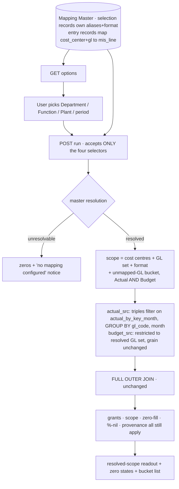

# Selection + mapping master

## What changes for you

**In scope.** The versioned repo-owned Mapping Master (selection + entry records) and its
strict loader; master-owned plant-alias authority; resolution of
`(department, function, plant, period)` to a scope or the unresolvable outcome, including
the server-derived `fy26-27-ytd`; narrowing the existing governed path (triple-filtered
`actual_src`, GL-restricted `budget_src`); the `unmapped-GL` bucket on **both** Actual and
Budget; two server-owned routes (options + run) with named DTOs and documented Swagger
errors; and one authenticated MIS Reports page showing the selector, the resolved-scope
readout, both zero states and the bucket list.

**Non-goals.** The finished hierarchical statement and **Excel export** (`mis-statement`); actuals drill-down
(`drill-down`); in-app authoring of the master (spec `:43-44`); non-nursery budgets; plants
beyond DUB; the balanced budget allocation (0014/0016, still deferred).

## Why

Make the MIS a **parameterized generator**: a user picks Department → Function → Plant →
period, and a centralized **Mapping Master** — never the Excel sheet or file name —
resolves which cost centres, GL codes and MIS format apply. The resolved
`(plant, cost_center, gl)` triples then **narrow the single governed query path** that
`governed-joins` shipped, so the numbers keep their grants, scope, zero-fill, %-nil rule
and provenance.

This fulfils decision **0014**'s explicit deferral ("a governed mapping master … DEFERRED
to the mis-selection and governed-joins stories") and closes the same coverage gap 0014
identified, via decision **0018**.

## Done when

1. Selecting **Agriculture / Nursery / DUB** returns exactly the DUB nursery slice.
2. Renaming the source file does not change the output.
3. A selection with **no mapping** renders zeros + a "no mapping configured" notice (no crash).

## Tasks

| ID | Name | What it delivers | Covers | Scope | Tests | After | User-facing |
|---|---|---|---|---|---|---|---|
| MAPPING-MASTER | Versioned Mapping Master + unmapped-GL bucket | Build the versioned repo-owned Mapping Master as the single runtime authority for selection and validation, with the unmapped-GL bucket keeping the DUB slice complete without inventing financial meaning. |  | `backend/src/mapping/mapping-master.ts`, `backend/src/mapping/mapping-master.test.ts`, `backend/src/mapping/mapping-master.db.test.ts`, `backend/src/mapping/mis-mapping-master.ts`, `backend/src/ingest/plant-mapping.ts`, `backend/src/ingest/sap-actuals.parser.test.ts`, `backend/package.json`, `tools/quality-gate.test.mjs` | `backend/src/mapping/mapping-master.test.ts` | none | no |
| SELECTION-RESOLUTION | Master-driven resolution, governed narrowing, and the first governed-query routes | Resolve a selection through the master and narrow the single governed query path to it, exposed by the first governed-query HTTP routes so a client can never widen a report. |  | `backend/src/mapping/selection-resolver.service.ts`, `backend/src/mapping/selection-resolver.service.test.ts`, `backend/src/sql/sqlBuilder.ts`, `backend/src/sql/sqlBuilder.selection.test.ts`, `backend/src/sql/sqlBuilder.composed.test.ts`, `backend/src/sql/sqlValidator.composed.test.ts`, `backend/src/chat/selectionExecutor.ts`, `backend/src/chat/selectionExecutor.composed.test.ts`, `backend/src/warehouse/selection-slice.db.test.ts`, `backend/src/mis/mis-selection.controller.ts`, `backend/src/mis/mis-selection.service.ts`, `backend/src/mis/mis-selection.dto.ts`, `backend/src/mis/mis-selection.module.ts`, `backend/src/mis/mis-selection.controller.test.ts`, `backend/src/app.module.ts`, `backend/src/app.routes.test.ts`, `contract/src/api.ts`, `backend/package.json`, `tools/quality-gate.test.mjs` | `backend/src/mapping/selection-resolver.service.test.ts`, `backend/src/sql/sqlBuilder.selection.test.ts`, `backend/src/mis/mis-selection.controller.test.ts`, `backend/src/chat/selectionExecutor.composed.test.ts` | MAPPING-MASTER | no |
| SELECTION-UI | Authenticated MIS Reports selection page | Give a user the authenticated MIS Reports page that produces the DUB nursery slice, distinguishes both zero states, and makes the mapping gap visible. |  | `frontend/app/(app)/mis-reports/page.tsx`, `frontend/src/features/mis/mis-report-view.tsx`, `frontend/src/features/mis/mis-report-view.test.tsx`, `frontend/src/features/mis/use-mis-selection.ts`, `frontend/src/lib/api.ts`, `frontend/src/lib/api.test.ts`, `frontend/src/components/shell/app-shell.tsx`, `frontend/src/components/shell/app-shell.test.tsx`, `frontend/app/globals.css`, `contract/src/api.ts`, `backend/src/mis/mis-selection.service.ts`, `backend/src/mis/mis-selection.controller.test.ts`, `backend/src/db/migrate.ts`, `backend/src/db/migrate.test.ts` | `frontend/src/features/mis/mis-report-view.test.tsx` | SELECTION-RESOLUTION | yes |

New moving parts: none named in the old plan

## Risks

- Touching the just-shipped governed builder risks regressing `governed-joins`' proofs —
  mitigated by keeping the reduction pre-join and re-running the whole `test:warehouse-proof`.
- The master is **authored**; a wrong Department/Function/line assignment is a silent content
  error, not a type error — mitigated by the completeness fixture and by the bucket making
  gaps visible on **both** sides.
- Folding alias authority into the master touches **ingest**, not just query — the parser and
  its fixtures move together or July's reconciliation total breaks.

## Notes

Converted from plans/active/mis-selection-selection-mapping-master.md by forge migrate.

### Decisions

All 18 active decisions were reviewed. Load-bearing here:

- **0014 (sap-ingestion, no master)** — not contradicted: its Consequences *defer* the
  governed mapping master to this story. Ingestion keeps ingesting the workbooks directly
  and retaining unmapped rows raw; the master governs **selection**, not ingest coverage.
  0014's deferred **balanced budget allocation stays deferred** — 0017 keeps Budget at
  `(gl_code, month)`, so nothing here needs it.
- **0016 (governed-joins PoC scope)** — partially revisited by 0017: cost centres become a
  **selection filter**, still never a join key, a Budget grain, or an output dimension.
- **0017 (composite-key seam)** — governs how selection reaches the governed layer.
  **Amended 2026-09-10 (grill Q6)**: its original closing consequence claimed D-0027 stayed
  open and blocked planning; that is superseded — see below.
- **0018 (unmapped-GL bucket)** — **governs the bucket question** and settled D-0027 the
  same day. Where 0017's stale text and 0018 disagreed, **0018 wins**; 0017 has been
  amended accordingly and the ledger records D-0027 as done. Planning is not blocked.
- **0019 (fresh routes follow the vendored house style)** — human-decided during the
  selection-resolution grill: the new MIS routes are unversioned `api/mis/...` returning raw
  typed bodies, and the `mis` module may import `mapping` directly, matching the vendored
  surface. DTOs, documented Swagger errors, cookie auth and strict unknown-field rejection
  are **not** relaxed. Revisit at the production pilot (0011 / D-0003).
- **0004 / 0015 / 0009** — one governed definition (LLM selects, never authors SQL);
  warehouse snake_case; required_tests use real leaf names + `TS_NODE_PROJECT`.
- **0012 (vendored-API deviation)** applies only to the *vendored* controllers. The routes
  this story adds are **fresh code**, so the constitution's typed request/response DTOs and
  documented Swagger error responses are **required**, not deferred (D-0020 covers vendored
  surfaces only).

### What already exists (grounding, file:line)

- **Cost-centre grain**: `warehouse-schema.ts:117-134` `actual_by_key_month` —
  `(plant, cost_center, gl_code, month, actual_net)`, active-batch filter **baked into the
  view**. Index `idx_sap_transaction_month_plant_cost_center_gl_code` (`:77-82`) covers the
  triple+month.
- **Pre-rolled grain**: `warehouse-schema.ts:136-150` `actual_by_gl_month` — `plant` is a
  **constant literal**, `cost_center` is gone. Hence 0017.
- **Budget**: `warehouse-schema.ts:152-169` `budget_by_gl_month` joins `ingest_batch`
  directly, **no plant column**, and admits **every** active budget GL.
- **Governed builder**: `sqlBuilder.ts:124-166` `composedCtes`; `scopePredicate` built at
  `:60-66`, injected inside the CTEs (`:65`); `objectsTouched` at `:117-121`;
  `sqlValidator.ts:43-49` rejects unlisted leaves. Pinned shape at
  `sqlBuilder.composed.test.ts:73`; `warehouse-schema.test.ts:187-201` pins the
  inherited-active-batch lineage.
- **Governed gate**: `selectionExecutor.ts:109-117` fail-closed on `report` action + domain
  + every measure/dimension. Grants seeded to `admin` (`migrate.ts:19-29`).
- **`Selection`**: `contract/src/measure.ts:146-159`. A filter whose `dimensionId` is not a
  declared dimension is **silently dropped** (`sqlBuilder.ts:70`) — triples cannot ride as
  ordinary filters.
- **Domain**: `semanticLayer.ts:16-20`, dimensions only `gl_code`/`month` (`:65-68`).
- **Routing reality**: `app.module.ts:11-16` imports Core/Health/Ingest only;
  `app.routes.test.ts:20-30` is a `deepEqual` **allowlist of 9 routes**; Reports/Chat
  controllers exist but are **unrouted**. Template: `reports.controller.ts` +
  `reports.service.ts:69-92`. Guards `auth.guard.ts` `AuthGuard`, `RequireAction` (`:77-90`),
  `@CurrentUser()` (`:92-98`); CSRF global (`app.module.ts:14`).
- **Plant aliases**: `ingest/plant-mapping.ts:1-7` hard-codes `{"DUB-NUR":"DUB"}`, applied
  **at ingest** (`sap-actuals.parser.ts:142`), canonical → `plant`, raw → `plant_src`. The
  display alias `Agri – Nursery – DUB` has no code representation.
- **Seed/config precedent**: frozen JSON + strict hand-written loader —
  `__fixtures__/july-dub-reconciliation.json` + `reconciliation.repository.ts:62-77` (note
  its `source` provenance string), and `golden-financial.db.test.ts:117-160` (exact-key-set
  + canonical-sort validation). **No JSON config outside `__fixtures__`**; runtime config is
  env-only (`config.ts`).
- **Frontend**: shell `app/(app)/layout.tsx:7-9`; pages at `app/(app)/<route>/page.tsx`.
  `app-shell.tsx:12-18` hard-codes nav with "MIS Reports" disabled (`:110-115`) and a
  hard-coded title (`:156`). Only `ui/button.tsx` is reusable. Tokens are CSS vars guarded
  by `tokens.test.ts`. `lib/api.ts` exposes **only 5 auth methods**.
- **Seed evidence (read from the workbook)**: `Sheet1` header `Plant | Cost Center | GL code
  | Revised GL name | Cost Center` — **two** Cost Center columns, 94 rows where B ≠ E, and
  only column **E** (`Primary`/`secondary`/`Tertiary`) matches what SAP books. **No
  Department, Function, format id, or MIS line/S.No.** All `Plant` = `DUB`. `SAP Report`:
  4,113 lines; only DUB-family plant is **`DUB-NUR`, 88 rows → 28 distinct triples**.
  `50001605` appears three times under different cost centres → **GL alone is not unique**.
  `Nursery MIS Format.xlsx` `Plant list` uses `DUB-NUR`.
- **Design**: prototype `3F Financial MIS.dc.html:79-122` four native `<select>`s
  (Department/Function/Plant/Period) + Generate; empty state `:126-140`; provenance popover
  `:545` rendering resolved scope in mono. Admin "Mapping master" table `:599-641` — its
  **column set** informs display; its **write affordances are non-binding** (spec `:34-35`,
  `:43-44`).

### Technical Approach

### The Mapping Master — one versioned artifact, two record kinds (grill Q3)
Flat per-triple rows would repeat Department/Function/aliases/format and let a conflicting
alias or format make resolution **non-deterministic** with no principled winner. Instead
one versioned, repo-owned master holds:

- **Selection records**, keyed by `(department, function, plant_canonical)`, owning the
  **aliases** (`DUB-NUR`, `Agri – Nursery – DUB`) and the **`mis_format`**. Alias authority
  is therefore genuinely singular, and these records *are* the selector's option source.
- **Entry records** under a selection: `(cost_center, gl_code) → mis_line`, plus
  `provisional` and a `reason`.

Workbooks remain **seed evidence** (a `source` provenance string, per the reconciliation
fixture convention) — never runtime input, which is what makes acceptance criterion 2 true.
Department, Function, `mis_format`/`mis_line` and the alias relation are **authored**;
Sheet1 has none of them. Column **E** is authoritative for `cost_center`.

### The unmapped-GL bucket (decision 0018, extended to Budget by grill Q2)
The nine unresolved Actual triples get **explicit** entries targeting the reserved
`unmapped-GL` line, flagged provisional with a reason — never inferred, never dropped:

| triple | rows | reason |
|---|---|---|
| `DUB-NUR / Primary / 50001701–50001706` | 8 | GL absent from Sheet1 |
| `DUB-NUR / Tertiary / 50001905` | 3 | GL absent from Sheet1 |
| `DUB-NUR / Primary / 50001902` | 8 | Sheet1 says Tertiary, SAP books Primary |
| `DUB-NUR / Primary / 50001903` | 3 | Sheet1 says Tertiary, SAP books Primary |

66 resolved + 22 bucketed = **88**. **Budget mirrors this** (human-decided, grill Q2): a
budget GL in the active batch but absent from the master also lands in the bucket, so both
sides are complete and reconcilable rather than silently truncated.

### Narrowing the governed path (0017 + grill Q2)
```sql
actual_src AS (
  SELECT gl_code, month, SUM(actual_net)::numeric(18,2) AS actual_net
  FROM actual_by_key_month
  WHERE <scopePredicate>                        -- unchanged: plant IN (validated scope)
    AND (plant, cost_center, gl_code) IN (<resolved triples>)
  GROUP BY gl_code, month
),
budget_src AS ( ... FROM budget_by_gl_month
  WHERE 'DUB' IN (<scope values>)               -- unchanged derived-constant guard
    AND gl_code IN (<resolved GL set>) )        -- NEW: Q2, grain unchanged
```
`actual_src` absorbs the `GROUP BY` that `actual_by_gl_month` performed, so the reduction to
one row per `(gl_code, month)` still happens **before** the FULL OUTER JOIN — the no-fan-out
invariant holds. **Restricting `budget_src` fixes a real defect**: today the join admits
every active DUB budget GL, so budget-only rows outside the resolved set would appear and
break acceptance criterion 1. Budget is **not** re-grained (0017-compatible).
`actual_by_key_month` **must** join `objectsTouched` or `sqlValidator.ts:43-49` blocks the
query. Triples travel as a **resolved-scope carrier** on the build input, never as
`selection.filters` (silently dropped, `sqlBuilder.ts:70`).

### API boundary — server-owned (grill Q1)
If a client could submit resolved scope it could **widen** a report; that escalation seam is
closed by construction. **Two** authenticated, documented routes:

- **options** — master-derived Department/Function/Plant/period choices.
- **run** — accepts **only** `{department, function, plant, period}`. It never accepts
  triples, GL codes, format ids or scope. The server resolves via the master, authorizes,
  and invokes the **existing** governed executor. The response carries the resolved-scope
  readout, the governed result, and bucket metadata.

Both carry **named request/response DTOs and documented Swagger error responses** (fresh
code — the 0012/D-0020 vendored deviation does not apply).

### Period contract (grill Q4)
Options are the **loaded** Actual months (July 2026 today) **plus one derived
`fy26-27-ytd`** — YTD is not a loaded month. The server resolves `fy26-27-ytd` to
`2026-04-01 → the latest active loaded month` (never the wall clock), so API and UI cannot
disagree.

### Zero states — decided by resolution, never row count
- selection **unresolvable** → zeros + "no mapping configured" notice;
- selection **resolves, no transactions** → configured zero statement, **no** notice.

### UI shape (grill Q5)
No new shared component API for a single page: styled **native `<select>`** controls local
to the MIS page (matching the prototype) plus the existing `Button`. A shared primitive is
promoted only when a second consumer exists.

### Workflow



### Verify Plan

Exact falsifying commands:
- `npm run build:contract && npm run build:backend && npm run typecheck && npm run lint && npm run format:check`
- `npm run test:hermetic` — must fail if: the master loader accepts a malformed/incomplete
  master or a duplicate `(department, function, plant)` selection key; resolution returns the
  wrong scope for Agriculture/Nursery/DUB or fails to return the unresolvable outcome for an
  unmapped selection; the builder omits the triple filter, omits the `budget_src` GL
  restriction, or omits `actual_by_key_month` from `objectsTouched`; the composed SQL fails
  the validator; `app.routes.test.ts` does not list exactly the two new routes; the run DTO
  accepts triples/GLs/scope; `fy26-27-ytd` resolves from the wall clock.
- `WAREHOUSE_PG_HOST=127.0.0.1 WAREHOUSE_PG_PORT=5433 … npm --prefix backend run test:warehouse-proof`
  — **D-0008 host proof**, must show `pass N / fail 0 / skipped 0`: every DUB raw triple
  resolves exactly once (66 mapped + 22 bucketed = 88), mapped + bucket totals equal the full
  DUB actuals total, and a cost-centre-filtered selection yields one row per
  `(gl_code, month)` with **no fan-out** and exact values.
- Same command with `WAREHOUSE_PG_PORT=5599` — **negative control**, the gated leaves must
  FAIL with `ECONNREFUSED`.
- `npm run test:frontend` + the functional check (user_facing): the authenticated selector
  yields the DUB nursery slice, the notice state, and the bucket list.

### Surface Impact

| Surface | Change | Classification |
|---|---|---|
| `backend/src/mapping/` (new) | master artifact + strict loader + resolution | new module |
| `backend/src/mapping/__fixtures__/*.json` (new) | the versioned master + completeness fixture | new config/fixture |
| `backend/src/ingest/plant-mapping.ts` (+ parser, its tests) | alias authority folded into the master | modified |
| `backend/src/sql/sqlBuilder.ts` | selection-aware `actual_src`, restricted `budget_src`, `objectsTouched` | modified (governed builder) |
| `backend/src/sql/sqlBuilder.composed.test.ts`, `sqlValidator.composed.test.ts` | pinned shapes move | modified tests |
| `backend/src/warehouse/*.db.test.ts`, `__fixtures__/governed-financial-golden.json` | selected-slice case added | modified tests/fixture |
| `contract/src/measure.ts` | resolved-scope carrier + DTO types | contract change |
| `backend/src/<selection>/` (new) | controller + service + DTOs + Swagger | new routes |
| `backend/src/app.module.ts`, `app.routes.test.ts` | first governed-query routes registered | modified (allowlist) |
| `backend/package.json`, `tools/quality-gate.test.mjs` | register the new gated proof | modified config |
| `frontend/app/(app)/<route>/page.tsx` (new) | MIS Reports page | new UI |
| `frontend/src/components/shell/app-shell.tsx` (+ its tests) | enable nav item + page title | modified |
| `frontend/src/lib/api.ts` | first data endpoint methods | modified |
| **Unchanged by design** | `budget_by_gl_month`, `actual_by_gl_month` and `actual_by_key_month` view bodies (no migration — the master filters, it does not re-shape); `selectionExecutor` authorization (reused, not widened); the `%`-nil CASE, zero-fill and provenance (0018/golden-provenance invariants); Budget grain; ingestion's raw retention (0014) | no change |

### Task Decomposition

**Three tasks** (the count is the human's call; recorded 2026-09-10 after this plan was
approved — merging the endpoint into resolution saves a full plan/grill/approval/review/PR
cycle, and the routes are inseparable from the resolution they exist to serve).

1. **mapping-master** (`user_facing: false`) — the versioned repo-owned master (selection +
   entry records) + strict loader + the `unmapped-GL` bucket entries for the nine triples,
   with the completeness fixture proving every DUB raw triple resolves exactly once
   (66 + 22 = 88, no drop, no fan-out). Folds the hard-coded plant alias into master-owned
   alias authority. **[shipped, PR #25]**
2. **selection-resolution** (`user_facing: false`) — resolve `(department, function, plant,
   period)` → scope (cost centres, GL set, format, bucket) or the unresolvable outcome,
   including the `fy26-27-ytd` derivation; narrow the governed path per 0017 + grill Q2
   (selection-aware `actual_src`, restricted `budget_src`, `objectsTouched`, the
   resolved-scope carrier, moved assertions), with the gated D-0008 no-fan-out proof; **and**
   the first governed-query HTTP routes — **options** + **run** on the `reports.controller`
   template, `AuthGuard` + `RequireAction("report")`, named DTOs + documented Swagger errors,
   the run request accepting **only** the four selectors, registered in `app.module.ts` and
   the `app.routes.test.ts` allow-list. Route/module shape follows decision **0019**.
3. **selection-ui** (`user_facing: true`) — the authenticated MIS Reports page: four native
   selects (loaded months + `fy26-27-ytd`), Generate, the resolved-scope readout, both zero
   states, and the unmapped-GL bucket list; enable the AppShell nav item + page title; the
   first data methods in `lib/api.ts`. Design specialists and the functional check are
   mandatory for this task.
