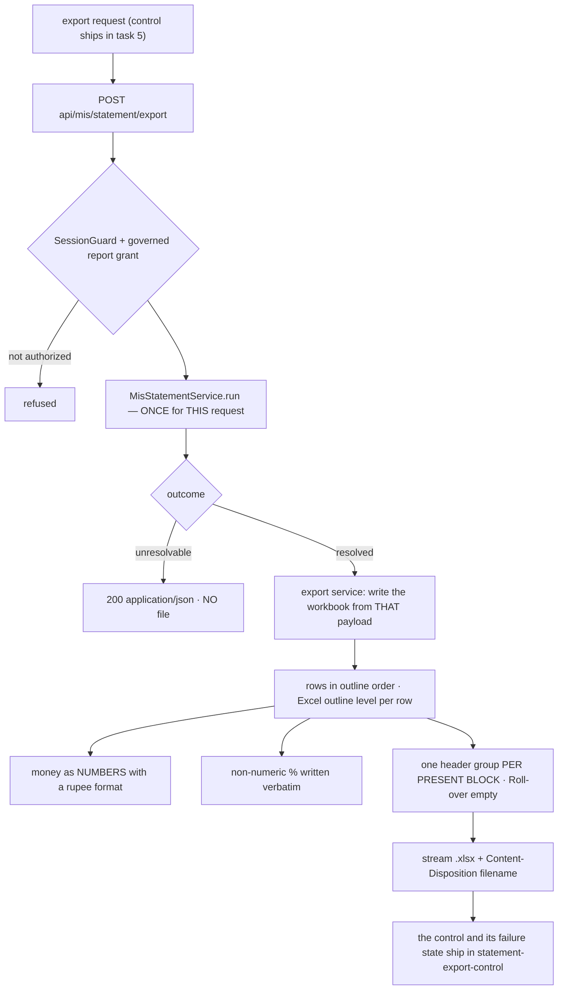

# Task plan — statement-export-api: the Excel export route and workbook writer

Story: mis-statement · Task 4 of 5 · **user_facing: false**

## Objective
Let Srihari take the statement away. `POST api/mis/statement/export` streams an `exceljs`
workbook written from the payload the statement service assembles **for that request**.

**Backend only.** The Download Excel control is `statement-export-control` — `WORKFLOW.md`
is explicit that backend and frontend never share a task, and the first draft of this
contract broke that rule.

This is the **first download route in the app**, so it sets the pattern drill-down's
transactions sheet will follow.

## Acceptance criteria (plan_contracts)
- **t-sea-c1** — the route takes the same four selectors and the **same protections** as
  the statement route: `AuthGuard` + `RequireAction("report")` under the global CSRF
  guard — **not** `SessionGuard`, which is the frontend's — with Swagger documenting the
  xlsx content type, the `Content-Disposition` header, the JSON unresolvable outcome and
  the required CSRF header, and the route added to the strict allow-list.
- **t-sea-c2** — a **resolved** request streams an `.xlsx` with a sanitized canonical
  filename naming scope and range; an **unresolvable** request keeps its existing
  `200 application/json` outcome and produces **no file**, so a client cannot save a JSON
  body as a workbook; an unauthorized plant is still refused.
- **t-sea-c3** — the workbook is written from the payload `MisStatementService.run`
  returns **for that request**, invoked **once**, and the writer never re-queries the
  projection, re-walks the outline or re-derives a subtotal — proven **cell by cell**.
- **t-sea-c4** — the sheet carries structure: a merged Identity header plus one header
  group **per present block** (one or two, matching the payload), the tree flattened in
  **preorder** with an Excel **outline level** per row, `S. No.`/Component/GL plus four
  columns per block, a final grand-total row, money as **numbers** with a rupee format,
  and a non-numeric `%` **verbatim**.

## What already exists (grounding, file:line)
- **The payload** — `contract/src/api.ts:270-300`: `MisStatementNode` (`nodeKey, sNo,
  budgetComponent, glCode, measures[], children[]`), `MisStatementMeasureBlock`
  (`key, label, from, to, budget, rollover: null, actual, percentage, sourcePresence`),
  `tree`, `grandTotal`, `provenance`. **Every subtotal is already derived** — the export
  writes, it does not compute.
- **The statement service** — `backend/src/mis/mis-statement.service.ts` assembles that
  tree today and returns it as JSON. The export must consume **that same assembly**, which
  is the whole point of splitting this task from task 2.
- **`exceljs@^4.4.0`** is already a backend dependency (`backend/package.json`) — used for
  *parsing* the client workbooks, and it writes too. **No new dependency.**
- **No download route exists** — there is no `Content-Disposition` or `StreamableFile`
  anywhere in `backend/src`. This is the first.
- **The route allow-list** — `backend/src/app.routes.test.ts` is strict and names every
  sanctioned route; a new one fails hermetic verification until it is listed (the lesson
  `statement-api` paid for).
- **The prototype's control** — `docs/design/…dc.html:117`: *Download Excel* as a
  **secondary** button — white ground, emerald border and text, 34px, 6px radius — beside
  the primary Generate.
- **The view** — `frontend/src/features/mis/statement-view.tsx` renders the statement
  inline; the control belongs beside it, and `constitution/07-exception-handling.md`'s
  one-clear-state rule already bit this view once.

## Design
### The drift guarantee is PER REQUEST
The defect this task exists to prevent is **drift**: a sheet that disagrees with the
screen. The first draft claimed "one assembly feeds both the JSON response and the
workbook" — **impossible**, because `/statement` and `/statement/export` are separate HTTP
requests with no shared object between them.

The guarantee that *is* achievable, and the one this task makes: **each endpoint invokes
`MisStatementService.run` exactly once per authorized request, and the export writer
receives that resolved payload** — it does not re-read the projection, re-walk the
outline, or re-derive a subtotal. Identical inputs therefore produce identical numbers,
and the cell-by-cell test holds that line.

### The sheet is a statement, not a picture of one
Money is written as **numbers** with a rupee number format, so the recipient can sum,
filter and pivot. Writing display strings would hand Srihari an image of his own
statement — the thing he already has. `FixedScaleMoney` is an exact decimal string:
convert it directly, never via the display-rounded value the screen shows.

Hierarchy survives as Excel **outline level** per row plus the workbook's own order, so
the structure is navigable rather than implied by leading spaces. Both blocks sit under
their spec labels. A non-numeric `%` — `over-budget`, `credit / negative actual` — is
written **verbatim**, not coerced.

### The route, and the JSON/XLSX boundary
`POST api/mis/statement/export`, same body, decision **0019** house style, protected by
`AuthGuard` + `RequireAction("report")` under the global CSRF guard.

A **resolved** request streams the workbook with a sanitized filename. An **unresolvable**
one keeps its `200 application/json` outcome and produces **no file** — a naive blob client
would otherwise save that JSON body as an `.xlsx` and hand Srihari a corrupt download. The
unresolvable outcome stays unresolvable: a download must not become a way around the
access contract, nor turn coverage into a 403.

### Blocks are dynamic
The payload carries **one or two** blocks — a selected FY-YTD period yields a single one —
so the sheet writes **one header group per present block**. A sheet that always writes two
contradicts the settled rule.

## Workflow

## Manual Verification
1. `npm run build:contract && npm run build:backend && npm run typecheck && npm run lint
   && npm run format:check && npm run test:hermetic && npm run test:frontend &&
   npm run build:frontend` — the four required leaves pass. Check each leaf's **executed
   count / testcase name**, not the exit code: `junit-run` false-passes a nonexistent
   `--name` (D-0024) and vitest exits 0 when `-t` matches nothing (D-0031).
2. The seven gated warehouse proofs still pass **unchanged** — this task adds no SQL.
3. **Open a really-generated workbook** (this task has no UI, so this is a host check,
   not the story's functional check): call the route for Agriculture / Nursery / DUB /
   Jul 2026 against the live stack, save the bytes, open them with `exceljs`, and confirm
   the hierarchy and outline order match the statement payload, the grand total reads
   **₹1,00,50,136** Budget against **₹1,15,12,712** Actual, amounts are **numeric** (a
   summed column agrees), Roll-over is empty, and the `unmapped-GL` line is present.

## Decisions attested
**0019** (the route's house style), **0016** (the grant and scope the download inherits),
**0018** (the `unmapped-GL` line travels into the sheet), **0020/0021/0022** (the derived
parents, outline and projection behind the numbers), **0023**, **0007/0010**,
**0009/0024/0031** (a required leaf must really execute), **0002/0003**, **0012/0015**.

## Surface impact
- **Backend**: `mis-statement-export.service.ts` + `.interface.ts` (NEW), the export route
  on `mis-statement.controller.ts`, `mis-statement.service.ts` refactored so one assembly
  feeds both renderings, the route allow-list entry.
- **Contract**: the export request/response shape in `contract/src/api.ts`.
- **Unchanged by design**: the statement's SQL and projection, the warehouse schema, the
  gated proofs, the selection routes, and **every frontend file** — the control is task 5.

## Out of scope
A transactions/line-items sheet (that ships with **drill-down**), the roll-over
calculation, Table-1 and Table-3, any pixel replica of the legacy 95-column workbook —
the spec asks for a **clean, correctly-structured** export, not a facsimile.

## Task Decomposition
Task 4 of the mis-statement story's **five**: (1) statement-model [#30], (2) statement-api
[#32], (3) statement-view [#34], (4) **statement-export-api** [this task],
(5) statement-export-control. The story grew from four tasks to five because this
contract originally held both the workbook writer and its download control, which
`WORKFLOW.md` forbids — backend and frontend never share a task. Proven by three backend
leaves plus a host check that opens a really-generated workbook.
