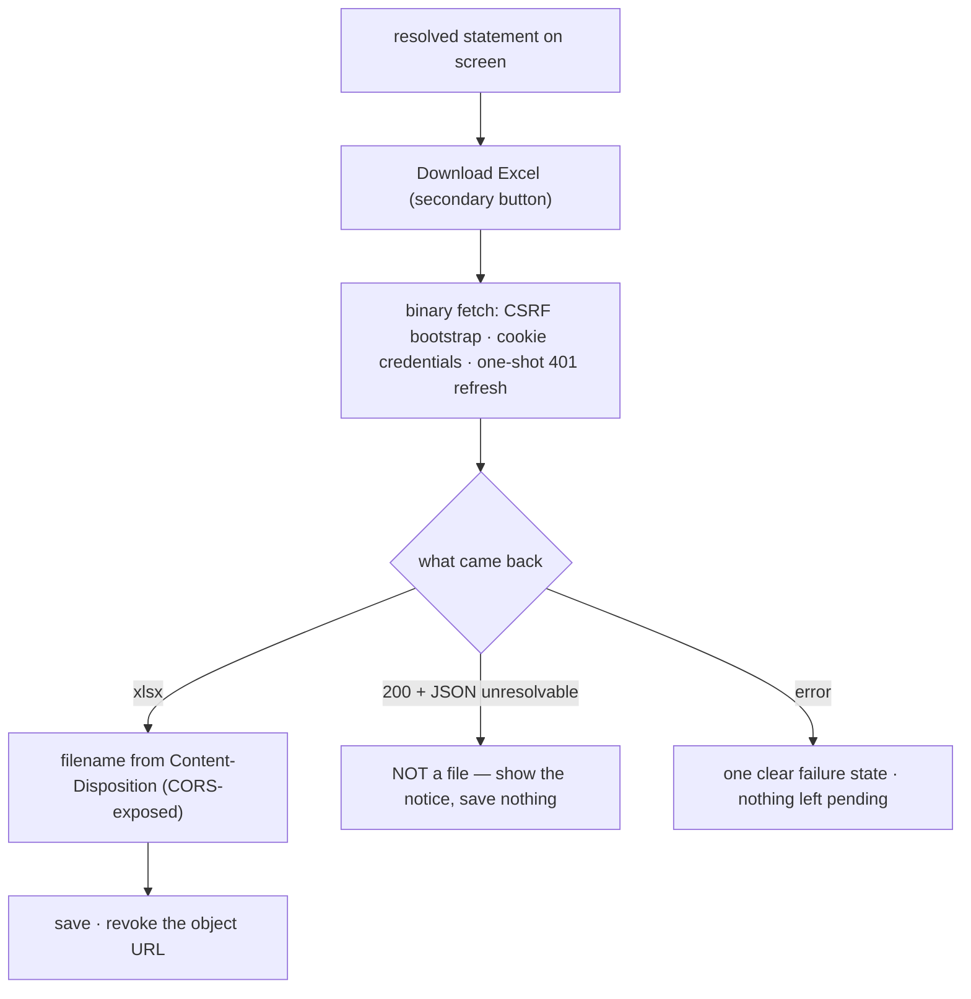

# Task plan — statement-export-control: the Download Excel control

Story: mis-statement · Task 5 of 5 (FINAL) · **user_facing: true**

## Objective
Give the statement a **Download Excel** control. The route and the workbook already ship
(`statement-export-api`, PR #35); this task is the button, the binary fetch that carries
it, and the one clear thing that happens when it fails.

Shipping it completes the **mis-statement** story.

## Acceptance criteria (plan_contracts)
- **t-sec-c1** — a Download Excel control beside the statement in the prototype's
  **secondary** treatment (white ground, emerald border and text, the Generate button's
  height and radius), shown **only when a resolved statement is on screen**.
- **t-sec-c2** — pressing it fetches the workbook through a **binary** client path that
  keeps the cookie credentials, CSRF bootstrap and one-shot 401 refresh, and saves it
  under the filename the **server** sent in `Content-Disposition`, falling back to the
  canonical name if absent.
- **t-sec-c3** — the **200-with-JSON** unresolvable outcome is **not saved as a file**.
- **t-sec-c4** — a failure surfaces as **one clear state**, never a silent no-op, and
  leaves neither the control nor the statement stuck pending.

## Mandatory for a user-facing task
`harness.yaml` — the recorder **refuses** a user-facing testing artifact unless
`skills_used` attests both `emil-design-eng` and `frontend-design`; both are inlined into
the composed brief. A **functional check** is also required — and for a download, that
means **actually downloading a file and opening it**, not watching a button change colour.

## What already exists (grounding, file:line)
- **The route, shipped** — `backend/src/mis/mis-statement.controller.ts:73-124`:
  `POST api/mis/statement/export` sets `Content-Type` to the xlsx MIME type and
  `Content-Disposition: attachment; filename="…"`, and returns **200 `application/json`**
  for an unresolvable selection with **no file headers**.
- **CORS already exposes the filename** — `backend/src/main.ts:32`
  `exposedHeaders: ["Content-Disposition"]`. That entry exists *because* this task needs
  it; deriving the filename client-side instead would make it pointless and let the two
  drift.
- **The client cannot currently carry bytes** — `frontend/src/lib/api.ts:30` `post<T>`
  ends in `response.json()`. Its CSRF bootstrap, cookie credentials and **one-shot 401
  refresh** (`:43-44`) are the parts worth keeping; the JSON parse is the part that cannot
  be reused. Hence a binary sibling, not a reuse.
- **The view** — `frontend/src/features/mis/statement-view.tsx` renders the statement
  inline and already distinguishes resolved from unresolvable. This view is also where a
  failure once rendered **alongside** the empty state; `constitution/07-exception-handling.md`'s
  one-clear-state rule is load-bearing here.
- **The prototype's control** — `docs/design/…dc.html:117`: *Download Excel* as a
  **secondary** button beside the primary Generate — white ground, emerald border and
  text, 34px, 6px radius.

## Design
### A binary sibling, not a reuse
`post<T>` parses JSON and cannot carry a workbook. The new helper does everything `post`
does **except** the parse: CSRF bootstrap, `credentials: "include"`, and the one-shot 401
refresh — dropping that last one would silently break the download for anyone whose access
token has just expired, which is the most ordinary case there is.

### Three outcomes, not two
A download has a third case the rest of the app does not:
- **xlsx** → save it under the server's filename;
- **200 + JSON** (unresolvable) → **not a file**; show the notice, save nothing. Saving it
  would put a corrupt `.xlsx` on someone's disk;
- **error** → one clear state.

The control **inspects what came back** before treating it as a workbook.

### The filename comes from the server
`Content-Disposition` is readable only because the route exposes it through CORS. The
control parses the header and falls back to the canonical name only when it is absent —
deriving it client-side would duplicate a grammar the server already owns.

### Housekeeping
An object URL created for a download is **revoked** after use; a page people click
repeatedly should not leak one per click.

## Workflow

## Manual Verification
1. `npm run typecheck && npm run lint && npm run format:check && npm run test:frontend &&
   npm run build:frontend` — the four required leaves pass. Check each leaf's **executed
   count**: vitest exits 0 when `-t` matches nothing (D-0031).
2. **Functional check (mandatory, user_facing)** — a download is only proven by a file:
   sign in, generate Agriculture / Nursery / DUB / Jul 2026, press **Download Excel**,
   then **open the saved file** and confirm it is the real workbook — worksheet
   `Financial MIS`, the hierarchy, and the grand total **₹1,00,50,136** Budget against
   **₹1,15,12,712** Actual — and that the saved filename is the server's, not a
   browser-generated one.
3. Force a failure (stop the backend) and confirm **one** clear state, nothing pending,
   and no file written.

## Decisions attested
**0019** (the route's house style), **0016** (the grant the download inherits), **0018**,
**0020/0021/0022** (the numbers behind the sheet), **0023**, **0007** (Next.js),
**0010** (3F branding), **0031** (a required leaf must really execute), **0002/0003**,
**0012/0015**.

## Surface impact
- **Frontend**: the Download Excel control and its failure state on `statement-view.tsx`,
  the binary export helper on `src/lib/api.ts`, the hook, `app/globals.css`.
- **Unchanged by design**: every backend file (the route and workbook ship in PR #35),
  `contract/src/api.ts`, the theme tokens, the statement's own rendering.

## Out of scope
A transactions sheet (drill-down), the roll-over calculation, any backend change.

## Task Decomposition
Task 5 (FINAL) of the mis-statement story: (1) statement-model [#30], (2) statement-api
[#32], (3) statement-view [#34], (4) statement-export-api [#35],
(5) **statement-export-control** [this task]. Frontend-only by construction — `WORKFLOW.md`
forbids a task spanning backend and frontend, which is why the export was split in two.
Proven by four vitest leaves plus a functional check that opens a really-downloaded file.
Shipping it completes the story.
